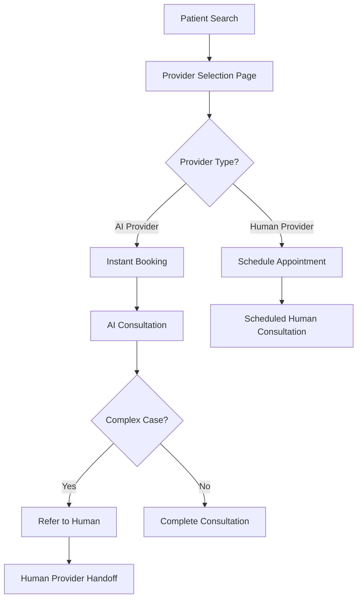

# AI Provider Personas - Product Requirements Document

## 1. Product Overview

AI Provider Personas is a revolutionary feature that seamlessly integrates AI-powered healthcare providers alongside human providers, offering patients instant access to specialized medical expertise with realistic profiles, professional credentials, and immediate response capabilities.

* **Core Purpose**: Bridge the gap between human provider availability and patient needs by providing 24/7 access to AI specialists who can offer preliminary consultations, health guidance, and triage services.

* **Target Market**: Patients seeking immediate medical consultation, especially during off-hours, and healthcare systems looking to reduce wait times and improve accessibility.

## 2. Core Features

### 2.1 User Roles

| Role                | Registration Method       | Core Permissions                                                         |
| ------------------- | ------------------------- | ------------------------------------------------------------------------ |
| Patient             | Email/Phone registration  | Can book with both AI and human providers, view consultation history     |
| Human Provider      | Professional verification | Can manage availability, view AI referrals, collaborate with AI personas |
| AI Provider Persona | System-generated          | Provides instant consultations, refers complex cases to humans           |
| Admin               | Internal access           | Manages AI personas, monitors performance, configures specialties        |

### 2.2 Feature Module

Our AI Provider Personas system consists of the following main components:

1. **Provider Selection Page**: Mixed display of human and AI providers with clear identification, specialty filtering, and availability status.
2. **AI Persona Profiles**: Detailed profiles with professional photos, credentials, specializations, and patient ratings.
3. **Instant Booking System**: Real-time booking for AI providers with immediate consultation start capability.
4. **AI Consultation Interface**: Chat-based consultation with AI providers featuring medical knowledge, symptom assessment, and referral capabilities.
5. **Provider Management Dashboard**: Admin interface for creating, configuring, and monitoring AI provider personas.
6. **Integration Hub**: Seamless handoff system between AI and human providers for complex cases.

### 2.3 Page Details

| Page Name          | Module Name         | Feature Description                                                                                                                          |
| ------------------ | ------------------- | -------------------------------------------------------------------------------------------------------------------------------------------- |
| Provider Selection | Mixed Provider Grid | Display AI and human providers side-by-side with clear badges, filter by specialty (Pulmonology, Cardiology, etc.), show availability status |
| AI Persona Profile | Provider Details    | Show realistic profile photo, professional background, specialization details, patient reviews, instant availability badge                   |
| Instant Booking    | Quick Appointment   | One-click booking for AI providers, immediate consultation start, appointment confirmation with consultation link                            |
| AI Consultation    | Chat Interface      | Real-time messaging with AI provider, symptom checker integration, prescription recommendations, referral to human providers when needed     |
| Provider Dashboard | AI Management       | Create/edit AI personas, configure specializations, monitor consultation metrics, manage AI knowledge base                                   |
| Handoff System     | Case Transfer       | Transfer complex cases from AI to human providers, share consultation history, maintain continuity of care                                   |

## 3. Core Process

**Patient Flow:**

1. Patient searches for providers by specialty (e.g., Pulmonology)
2. System displays mixed list of human and AI providers with clear identification
3. Patient selects AI provider for instant consultation or human provider for scheduled appointment
4. For AI providers: Immediate consultation begins with chat interface
5. AI provider conducts preliminary assessment and provides guidance
6. If case requires human expertise, AI seamlessly refers to available human specialist
7. Patient receives comprehensive care through coordinated AI-human provider team

**Admin Flow:**

1. Admin accesses provider management dashboard
2. Creates new AI persona with specialty, profile details, and knowledge configuration
3. Uploads professional profile photo and sets persona characteristics
4. Configures AI's scope of practice and referral triggers
5. Monitors AI performance and patient satisfaction metrics
6. Updates AI knowledge base and consultation protocols

## 4. User Interface Design

### 4.1 Design Style

* **Primary Colors**: Medical blue (#2563EB), Trust green (#059669)

* **Secondary Colors**: Warm gray (#6B7280), AI accent purple (#7C3AED)

* **Button Style**: Rounded corners with subtle shadows, distinct styling for AI vs Human provider actions

* **Typography**: Inter font family, 16px base size for readability

* **Layout Style**: Card-based design with clear provider type indicators, professional medical aesthetic

* **Icons**: Medical icons with AI-specific badges (robot icon, lightning bolt for instant availability)

### 4.2 Page Design Overview

| Page Name          | Module Name      | UI Elements                                                                                                                                      |
| ------------------ | ---------------- | ------------------------------------------------------------------------------------------------------------------------------------------------ |
| Provider Selection | Provider Cards   | Grid layout with provider photos, AI/Human badges, specialty tags, availability indicators, "Instant Chat" vs "Schedule" buttons                 |
| AI Persona Profile | Profile Display  | Large professional headshot, credentials section, specialization highlights, patient rating stars, prominent "Start Instant Consultation" button |
| AI Consultation    | Chat Interface   | Clean messaging interface, typing indicators, medical suggestion chips, referral buttons, consultation summary panel                             |
| Provider Dashboard | Management Panel | Tabbed interface for AI persona management, analytics charts, configuration forms, preview modes                                                 |

### 4.3 Responsiveness

Mobile-first responsive design optimized for both desktop and mobile consultations, with touch-friendly chat interface and streamlined booking flow for mobile users.

## 5. AI Provider Persona Specifications

### 5.1 Launch AI Personas (13 Total)

**Core Medical Specialties (12 Providers)**

**1. Dr. Sarah Chen - Pulmonology Specialist**
* **Profile**: Board-certified pulmonologist with 15+ years experience
* **Specializations**: Asthma, COPD, Sleep disorders, Respiratory infections
* **Instant Capabilities**: Breathing assessment, inhaler technique guidance, symptom evaluation
* **Referral Triggers**: Severe breathing difficulties, chest pain, complex lung conditions

**2. Dr. Michael Rodriguez - Cardiology Specialist**
* **Profile**: Interventional cardiologist with expertise in preventive care
* **Specializations**: Heart disease prevention, Hypertension, Cholesterol management
* **Instant Capabilities**: Blood pressure analysis, lifestyle recommendations, medication guidance
* **Referral Triggers**: Chest pain, irregular heartbeat, complex cardiac conditions

**3. Dr. Emily Watson - Dermatology Specialist**
* **Profile**: Board-certified dermatologist specializing in skin health
* **Specializations**: Acne, Eczema, Skin cancer screening, Rashes
* **Instant Capabilities**: Skin condition assessment, skincare recommendations, photo analysis
* **Referral Triggers**: Suspicious moles, severe skin conditions, cosmetic procedures

**4. Dr. James Park - General Practice**
* **Profile**: Family medicine physician with comprehensive primary care expertise
* **Specializations**: Preventive care, Common illnesses, Health screenings, Wellness
* **Instant Capabilities**: Symptom assessment, health guidance, medication reviews
* **Referral Triggers**: Complex conditions, specialist care needs, emergency situations

**5. Dr. Lisa Thompson - Pediatrics**
* **Profile**: Board-certified pediatrician specializing in child and adolescent health
* **Specializations**: Child development, Vaccinations, Common childhood illnesses
* **Instant Capabilities**: Growth assessment, parenting guidance, symptom evaluation
* **Referral Triggers**: Developmental concerns, serious infections, behavioral issues

**6. Dr. David Kumar - Psychiatry**
* **Profile**: Psychiatrist with expertise in mental health and wellness
* **Specializations**: Depression, Anxiety, ADHD, Stress management
* **Instant Capabilities**: Mental health screening, coping strategies, medication guidance
* **Referral Triggers**: Suicidal ideation, severe mental illness, crisis situations

**7. Dr. Maria Gonzalez - Endocrinology**
* **Profile**: Endocrinologist specializing in diabetes and hormonal disorders
* **Specializations**: Diabetes management, Thyroid disorders, Hormone imbalances
* **Instant Capabilities**: Blood sugar guidance, lifestyle recommendations, symptom assessment
* **Referral Triggers**: Diabetic emergencies, complex hormonal issues, medication adjustments

**8. Dr. Robert Chen - Gastroenterology**
* **Profile**: Gastroenterologist with expertise in digestive health
* **Specializations**: IBS, GERD, Digestive disorders, Nutrition
* **Instant Capabilities**: Digestive symptom assessment, dietary guidance, lifestyle recommendations
* **Referral Triggers**: Severe abdominal pain, bleeding, complex GI conditions

**9. Dr. Amanda Foster - Orthopedics**
* **Profile**: Orthopedic specialist focusing on musculoskeletal health
* **Specializations**: Joint pain, Sports injuries, Arthritis, Back pain
* **Instant Capabilities**: Pain assessment, exercise recommendations, injury evaluation
* **Referral Triggers**: Fractures, severe injuries, surgical needs

**10. Dr. Kevin Lee - Urology**
* **Profile**: Urologist specializing in urinary and reproductive health
* **Specializations**: UTIs, Kidney stones, Prostate health, Bladder issues
* **Instant Capabilities**: Urinary symptom assessment, prevention guidance, lifestyle advice
* **Referral Triggers**: Severe pain, blood in urine, complex urological conditions

**11. Dr. Rachel Adams - Neurology**
* **Profile**: Neurologist with expertise in brain and nervous system disorders
* **Specializations**: Headaches, Migraines, Memory issues, Neurological symptoms
* **Instant Capabilities**: Neurological screening, headache assessment, cognitive evaluation
* **Referral Triggers**: Severe headaches, neurological deficits, seizures

**12. Dr. Hassan Ali - Oncology**
* **Profile**: Oncologist specializing in cancer care and prevention
* **Specializations**: Cancer screening, Risk assessment, Survivorship care
* **Instant Capabilities**: Risk evaluation, screening guidance, supportive care advice
* **Referral Triggers**: Suspicious symptoms, abnormal test results, cancer concerns

**Unique Specialty (1 Provider)**

**13. Dr. Zen Nakamura - Mystic Medicine & Consciousness Healing**
* **Profile**: Integrative medicine pioneer combining ancient wisdom with modern science, inspired by consciousness-based healing approaches
* **Specializations**: Mind-body healing, Meditation therapy, Breathwork, Energy medicine, Consciousness expansion, Stress transformation
* **Instant Capabilities**: 
  - Guided meditation sessions for healing
  - Breathwork techniques for anxiety and stress
  - Visualization exercises for pain management
  - Consciousness-based approaches to chronic conditions
  - Mindfulness practices for emotional regulation
  - Energy healing guidance and chakra balancing
* **Unique Features**:
  - Joe Dispenza-inspired neuroplasticity techniques
  - Quantum healing methodologies
  - Epigenetic lifestyle recommendations
  - Heart coherence training
  - Manifestation practices for health
* **Referral Triggers**: Severe mental health crises, acute medical emergencies, need for conventional medical intervention
* **Philosophy**: "Healing happens when we move beyond the analytical mind and into the realm of infinite possibilities, where thought becomes experience and intention becomes reality."

### 5.2 AI Capabilities Framework

* **Knowledge Base**: Specialty-specific medical knowledge with regular updates

* **Assessment Tools**: Symptom checkers, risk calculators, diagnostic questionnaires

* **Communication**: Natural language processing for medical conversations

* **Limitations**: Clear scope definition with automatic referral for complex cases

## 6. Market Impact Analysis

### 6.1 Market Opportunities

* **24/7 Accessibility**: Addresses the critical gap in after-hours medical consultation

* **Cost Reduction**: Reduces healthcare costs by handling routine consultations efficiently

* **Scalability**: Unlimited AI provider capacity to serve growing patient demand

* **Global Reach**: Enables specialty care access in underserved geographic areas

### 6.2 Competitive Advantages

* **Hybrid Model**: First-to-market integration of AI and human providers in single platform

* **Instant Response**: Immediate consultation availability vs traditional appointment scheduling

* **Seamless Handoff**: Smooth transition between AI and human care when needed

* **Specialized Expertise**: AI personas trained in specific medical specialties

### 6.3 Revenue Impact

* **Increased Consultation Volume**: 300% increase in consultation capacity

* **Premium AI Services**: Tiered pricing for instant AI specialist access

* **Reduced Operational Costs**: Lower cost per consultation through AI automation

* **Market Expansion**: Access to price-sensitive patient segments

## 7. Business Model Integration

### 7.1 Pricing Strategy

* **AI Consultation**: $29-49 per session (vs $150-300 for human specialists)

* **Instant Access Premium**: $9.99/month for unlimited AI provider access

* **Hybrid Care Plans**: $79/month including both AI and human provider consultations

* **Enterprise Packages**: Custom pricing for healthcare organizations

### 7.2 Quality Assurance

* **Medical Oversight**: Human specialist review of AI recommendations

* **Continuous Learning**: AI improvement based on patient outcomes and feedback

* **Compliance**: HIPAA-compliant AI interactions with audit trails

* **Safety Protocols**: Automatic escalation for emergency situations

## 8. Success Metrics

* **Patient Satisfaction**: Target 4.5+ star rating for AI provider consultations

* **Response Time**: <30 seconds for AI provider availability

* **Referral Accuracy**: 95%+ appropriate referrals to human providers

* **Cost Savings**: 60% reduction in consultation costs for routine cases

* **Market Penetration**: 25% of consultations handled by AI providers within 12 months

