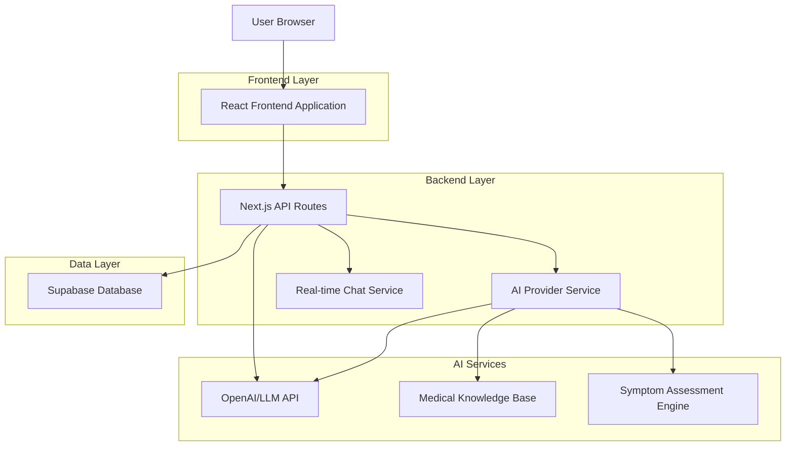
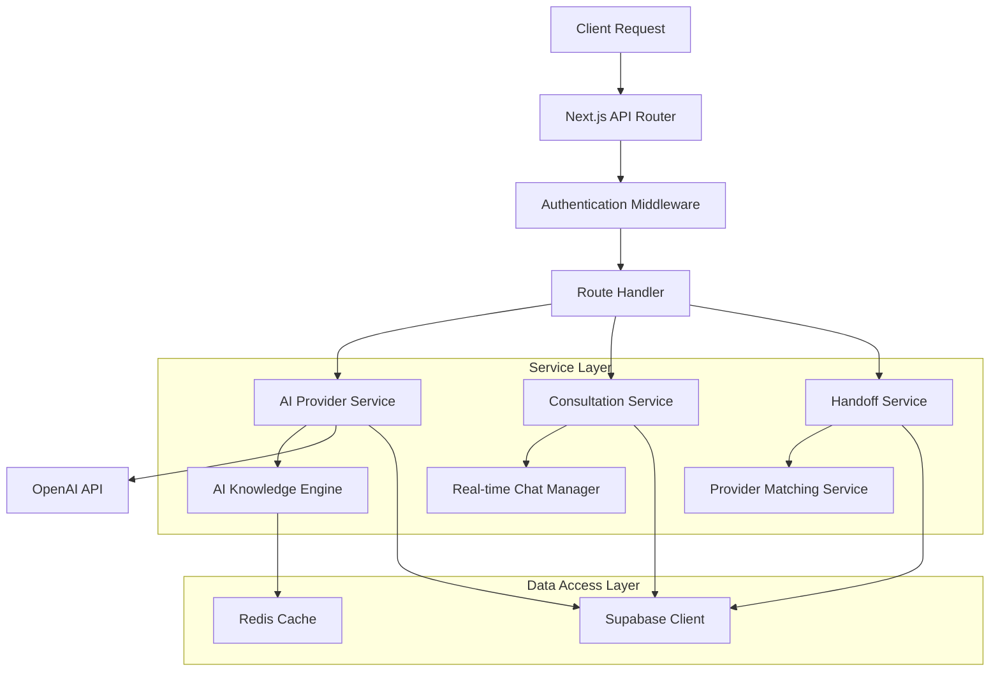
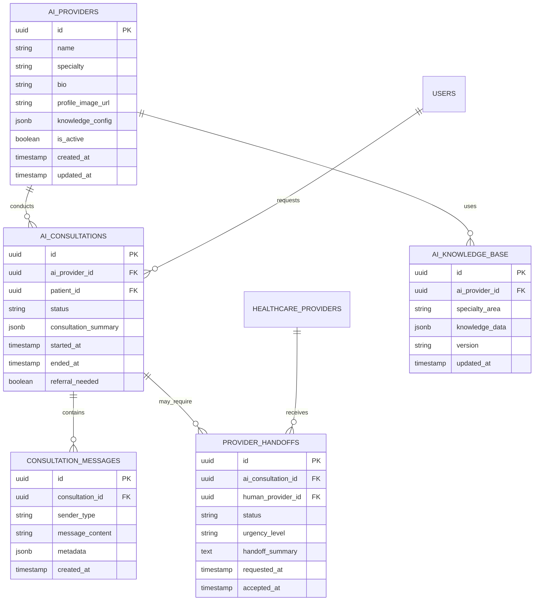

# AI Provider Personas - Technical Architecture Document

## 1. Architecture Design



## 2. Technology Description

* **Frontend**: React\@18 + Next.js\@14 + TypeScript + Tailwind CSS

* **Backend**: Next.js API Routes + Node.js

* **Database**: Supabase (PostgreSQL) with real-time subscriptions

* **AI Services**: OpenAI GPT-4 + Custom medical knowledge base

* **Real-time**: Supabase Realtime + WebSocket connections

* **Authentication**: Supabase Auth with role-based access

* **File Storage**: Supabase Storage for profile images

## 3. Route Definitions

| Route                                | Purpose                                 |
| ------------------------------------ | --------------------------------------- |
| /providers                           | Mixed provider listing (AI + Human)     |
| /providers/ai/\[id]                  | AI provider profile and instant booking |
| /providers/human/\[id]               | Human provider profile and scheduling   |
| /consultation/ai/\[sessionId]        | AI consultation chat interface          |
| /consultation/human/\[appointmentId] | Human provider consultation             |
| /admin/ai-providers                  | AI provider management dashboard        |
| /handoff/\[consultationId]           | AI to human provider handoff interface  |

## 4. API Definitions

### 4.1 AI Provider Management

**Get AI Providers**

```
GET /api/providers/ai
```

Query Parameters:

| Param Name | Param Type | isRequired | Description                   |
| ---------- | ---------- | ---------- | ----------------------------- |
| specialty  | string     | false      | Filter by medical specialty   |
| available  | boolean    | false      | Filter by availability status |
| limit      | number     | false      | Number of results to return   |

Response:

| Param Name | Param Type    | Description                  |
| ---------- | ------------- | ---------------------------- |
| providers  | AIProvider\[] | Array of AI provider objects |
| total      | number        | Total count of providers     |

**Create AI Provider**

```
POST /api/providers/ai
```

Request:

| Param Name      | Param Type | isRequired | Description                |
| --------------- | ---------- | ---------- | -------------------------- |
| name            | string     | true       | AI provider display name   |
| specialty       | string     | true       | Medical specialty          |
| bio             | string     | true       | Professional background    |
| profileImage    | string     | true       | Profile image URL          |
| knowledgeConfig | object     | true       | AI knowledge configuration |

### 4.2 AI Consultation API

**Start AI Consultation**

```
POST /api/consultations/ai/start
```

Request:

| Param Name     | Param Type | isRequired | Description               |
| -------------- | ---------- | ---------- | ------------------------- |
| providerId     | string     | true       | AI provider ID            |
| patientId      | string     | true       | Patient user ID           |
| initialMessage | string     | false      | Patient's initial message |

Response:

| Param Name | Param Type | Description                    |
| ---------- | ---------- | ------------------------------ |
| sessionId  | string     | Unique consultation session ID |
| aiProvider | object     | AI provider details            |
| chatUrl    | string     | Real-time chat endpoint        |

**Send Message to AI**

```
POST /api/consultations/ai/[sessionId]/message
```

Request:

| Param Name  | Param Type | isRequired | Description                |
| ----------- | ---------- | ---------- | -------------------------- |
| message     | string     | true       | Patient message content    |
| messageType | string     | false      | Type: text, symptom, image |

Response:

| Param Name     | Param Type | Description                           |
| -------------- | ---------- | ------------------------------------- |
| aiResponse     | string     | AI provider response                  |
| suggestions    | string\[]  | Follow-up suggestions                 |
| referralNeeded | boolean    | Whether human referral is recommended |

### 4.3 Provider Handoff API

**Request Human Referral**

```
POST /api/consultations/handoff
```

Request:

| Param Name  | Param Type | isRequired | Description                      |
| ----------- | ---------- | ---------- | -------------------------------- |
| aiSessionId | string     | true       | Current AI consultation session  |
| specialty   | string     | true       | Required human specialist type   |
| urgency     | string     | true       | Urgency level: low, medium, high |
| summary     | string     | true       | AI consultation summary          |

Response:

| Param Name         | Param Type | Description                    |
| ------------------ | ---------- | ------------------------------ |
| handoffId          | string     | Handoff request ID             |
| availableProviders | object\[]  | Available human providers      |
| estimatedWait      | number     | Estimated wait time in minutes |

## 5. Server Architecture Diagram



## 6. Data Model

### 6.1 Data Model Definition



### 6.2 Data Definition Language

**AI Providers Table**

```sql
-- Create AI providers table
CREATE TABLE ai_providers (
    id UUID PRIMARY KEY DEFAULT gen_random_uuid(),
    name VARCHAR(255) NOT NULL,
    specialty VARCHAR(100) NOT NULL,
    bio TEXT NOT NULL,
    profile_image_url TEXT,
    knowledge_config JSONB DEFAULT '{}',
    is_active BOOLEAN DEFAULT true,
    created_at TIMESTAMP WITH TIME ZONE DEFAULT NOW(),
    updated_at TIMESTAMP WITH TIME ZONE DEFAULT NOW()
);

-- Create indexes
CREATE INDEX idx_ai_providers_specialty ON ai_providers(specialty);
CREATE INDEX idx_ai_providers_active ON ai_providers(is_active);

-- Insert sample AI providers (13 total for launch)
INSERT INTO ai_providers (name, specialty, bio, profile_image_url, knowledge_config) VALUES
-- Core Medical Specialties (12 providers)
('Dr. Sarah Chen', 'Pulmonology', 'Board-certified pulmonologist with expertise in respiratory conditions, asthma management, and sleep disorders.', '/images/ai-providers/dr-sarah-chen.jpg', '{"specializations": ["asthma", "copd", "sleep_disorders"], "referral_triggers": ["severe_breathing_difficulty", "chest_pain", "complex_lung_conditions"]}'),
('Dr. Michael Rodriguez', 'Cardiology', 'Interventional cardiologist focused on preventive cardiology, hypertension management, and heart disease prevention.', '/images/ai-providers/dr-michael-rodriguez.jpg', '{"specializations": ["hypertension", "cholesterol", "heart_disease_prevention"], "referral_triggers": ["chest_pain", "irregular_heartbeat", "complex_cardiac_conditions"]}'),
('Dr. Emily Watson', 'Dermatology', 'Dermatologist specializing in skin condition diagnosis, acne treatment, and preventive skin care.', '/images/ai-providers/dr-emily-watson.jpg', '{"specializations": ["acne", "eczema", "skin_cancer_screening"], "referral_triggers": ["suspicious_moles", "severe_skin_conditions", "cosmetic_procedures"]}'),
('Dr. James Park', 'General Practice', 'Family medicine physician with comprehensive primary care expertise in preventive care and wellness.', '/images/ai-providers/dr-james-park.jpg', '{"specializations": ["preventive_care", "common_illnesses", "health_screenings"], "referral_triggers": ["complex_conditions", "specialist_care_needs", "emergency_situations"]}'),
('Dr. Lisa Thompson', 'Pediatrics', 'Board-certified pediatrician specializing in child and adolescent health, development, and family guidance.', '/images/ai-providers/dr-lisa-thompson.jpg', '{"specializations": ["child_development", "vaccinations", "childhood_illnesses"], "referral_triggers": ["developmental_concerns", "serious_infections", "behavioral_issues"]}'),
('Dr. David Kumar', 'Psychiatry', 'Psychiatrist with expertise in mental health, wellness, and evidence-based therapeutic approaches.', '/images/ai-providers/dr-david-kumar.jpg', '{"specializations": ["depression", "anxiety", "adhd", "stress_management"], "referral_triggers": ["suicidal_ideation", "severe_mental_illness", "crisis_situations"]}'),
('Dr. Maria Gonzalez', 'Endocrinology', 'Endocrinologist specializing in diabetes management, thyroid disorders, and hormonal health.', '/images/ai-providers/dr-maria-gonzalez.jpg', '{"specializations": ["diabetes_management", "thyroid_disorders", "hormone_imbalances"], "referral_triggers": ["diabetic_emergencies", "complex_hormonal_issues", "medication_adjustments"]}'),
('Dr. Robert Chen', 'Gastroenterology', 'Gastroenterologist with expertise in digestive health, nutrition, and gastrointestinal disorders.', '/images/ai-providers/dr-robert-chen.jpg', '{"specializations": ["ibs", "gerd", "digestive_disorders", "nutrition"], "referral_triggers": ["severe_abdominal_pain", "bleeding", "complex_gi_conditions"]}'),
('Dr. Amanda Foster', 'Orthopedics', 'Orthopedic specialist focusing on musculoskeletal health, sports medicine, and injury prevention.', '/images/ai-providers/dr-amanda-foster.jpg', '{"specializations": ["joint_pain", "sports_injuries", "arthritis", "back_pain"], "referral_triggers": ["fractures", "severe_injuries", "surgical_needs"]}'),
('Dr. Kevin Lee', 'Urology', 'Urologist specializing in urinary and reproductive health with focus on preventive care.', '/images/ai-providers/dr-kevin-lee.jpg', '{"specializations": ["utis", "kidney_stones", "prostate_health", "bladder_issues"], "referral_triggers": ["severe_pain", "blood_in_urine", "complex_urological_conditions"]}'),
('Dr. Rachel Adams', 'Neurology', 'Neurologist with expertise in brain and nervous system disorders, headache management, and cognitive health.', '/images/ai-providers/dr-rachel-adams.jpg', '{"specializations": ["headaches", "migraines", "memory_issues", "neurological_symptoms"], "referral_triggers": ["severe_headaches", "neurological_deficits", "seizures"]}'),
('Dr. Hassan Ali', 'Oncology', 'Oncologist specializing in cancer prevention, screening, survivorship care, and supportive oncology.', '/images/ai-providers/dr-hassan-ali.jpg', '{"specializations": ["cancer_screening", "risk_assessment", "survivorship_care"], "referral_triggers": ["suspicious_symptoms", "abnormal_test_results", "cancer_concerns"]}'),
-- Unique Specialty (1 provider)
('Dr. Zen Nakamura', 'Mystic Medicine', 'Integrative medicine pioneer combining ancient wisdom with modern science, specializing in consciousness-based healing approaches inspired by Joe Dispenza methodologies.', '/images/ai-providers/dr-zen-nakamura.jpg', '{"specializations": ["mind_body_healing", "meditation_therapy", "breathwork", "energy_medicine", "consciousness_expansion"], "unique_features": ["neuroplasticity_techniques", "quantum_healing", "epigenetic_lifestyle", "heart_coherence", "manifestation_practices"], "referral_triggers": ["severe_mental_health_crises", "acute_medical_emergencies", "conventional_medical_intervention_needed"], "philosophy": "Healing happens when we move beyond the analytical mind and into the realm of infinite possibilities"}')
```

**AI Consultations Table**

```sql
-- Create AI consultations table
CREATE TABLE ai_consultations (
    id UUID PRIMARY KEY DEFAULT gen_random_uuid(),
    ai_provider_id UUID NOT NULL REFERENCES ai_providers(id),
    patient_id UUID NOT NULL REFERENCES users(id),
    status VARCHAR(50) DEFAULT 'active' CHECK (status IN ('active', 'completed', 'transferred', 'cancelled')),
    consultation_summary JSONB DEFAULT '{}',
    started_at TIMESTAMP WITH TIME ZONE DEFAULT NOW(),
    ended_at TIMESTAMP WITH TIME ZONE,
    referral_needed BOOLEAN DEFAULT false
);

-- Create indexes
CREATE INDEX idx_ai_consultations_provider ON ai_consultations(ai_provider_id);
CREATE INDEX idx_ai_consultations_patient ON ai_consultations(patient_id);
CREATE INDEX idx_ai_consultations_status ON ai_consultations(status);
CREATE INDEX idx_ai_consultations_started ON ai_consultations(started_at DESC);
```

**Consultation Messages Table**

```sql
-- Create consultation messages table
CREATE TABLE consultation_messages (
    id UUID PRIMARY KEY DEFAULT gen_random_uuid(),
    consultation_id UUID NOT NULL REFERENCES ai_consultations(id) ON DELETE CASCADE,
    sender_type VARCHAR(20) NOT NULL CHECK (sender_type IN ('patient', 'ai_provider')),
    message_content TEXT NOT NULL,
    metadata JSONB DEFAULT '{}',
    created_at TIMESTAMP WITH TIME ZONE DEFAULT NOW()
);

-- Create indexes
CREATE INDEX idx_consultation_messages_consultation ON consultation_messages(consultation_id);
CREATE INDEX idx_consultation_messages_created ON consultation_messages(created_at);
```

**Provider Handoffs Table**

```sql
-- Create provider handoffs table
CREATE TABLE provider_handoffs (
    id UUID PRIMARY KEY DEFAULT gen_random_uuid(),
    ai_consultation_id UUID NOT NULL REFERENCES ai_consultations(id),
    human_provider_id UUID REFERENCES healthcare_providers(id),
    status VARCHAR(50) DEFAULT 'pending' CHECK (status IN ('pending', 'accepted', 'completed', 'declined')),
    urgency_level VARCHAR(20) DEFAULT 'medium' CHECK (urgency_level IN ('low', 'medium', 'high', 'urgent')),
    handoff_summary TEXT NOT NULL,
    requested_at TIMESTAMP WITH TIME ZONE DEFAULT NOW(),
    accepted_at TIMESTAMP WITH TIME ZONE
);

-- Create indexes
CREATE INDEX idx_provider_handoffs_ai_consultation ON provider_handoffs(ai_consultation_id);
CREATE INDEX idx_provider_handoffs_human_provider ON provider_handoffs(human_provider_id);
CREATE INDEX idx_provider_handoffs_status ON provider_handoffs(status);
```

**AI Knowledge Base Table**

```sql
-- Create AI knowledge base table
CREATE TABLE ai_knowledge_base (
    id UUID PRIMARY KEY DEFAULT gen_random_uuid(),
    ai_provider_id UUID NOT NULL REFERENCES ai_providers(id),
    specialty_area VARCHAR(100) NOT NULL,
    knowledge_data JSONB NOT NULL,
    version VARCHAR(20) DEFAULT '1.0',
    updated_at TIMESTAMP WITH TIME ZONE DEFAULT NOW()
);

-- Create indexes
CREATE INDEX idx_ai_knowledge_provider ON ai_knowledge_base(ai_provider_id);
CREATE INDEX idx_ai_knowledge_specialty ON ai_knowledge_base(specialty_area);
```

## 7. Security and Permissions

**Row Level Security (RLS) Policies**

```sql
-- Enable RLS on all tables
ALTER TABLE ai_providers ENABLE ROW LEVEL SECURITY;
ALTER TABLE ai_consultations ENABLE ROW LEVEL SECURITY;
ALTER TABLE consultation_messages ENABLE ROW LEVEL SECURITY;
ALTER TABLE provider_handoffs ENABLE ROW LEVEL SECURITY;

-- AI providers - public read access
CREATE POLICY "AI providers are viewable by everyone" ON ai_providers
    FOR SELECT USING (is_active = true);

-- AI consultations - patients can only see their own
CREATE POLICY "Patients can view their own AI consultations" ON ai_consultations
    FOR SELECT USING (auth.uid() = patient_id);

-- Consultation messages - participants only
CREATE POLICY "Consultation participants can view messages" ON consultation_messages
    FOR SELECT USING (
        EXISTS (
            SELECT 1 FROM ai_consultations 
            WHERE id = consultation_id 
            AND patient_id = auth.uid()
        )
    );

-- Grant permissions
GRANT SELECT ON ai_providers TO anon, authenticated;
GRANT ALL ON ai_consultations TO authenticated;
GRANT ALL ON consultation_messages TO authenticated;
GRANT ALL ON provider_handoffs TO authenticated;
```

## 8. Real-time Implementation

**Supabase Realtime Configuration**

```sql
-- Enable realtime for consultation messages
ALTER PUBLICATION supabase_realtime ADD TABLE consultation_messages;
ALTER PUBLICATION supabase_realtime ADD TABLE ai_consultations;
ALTER PUBLICATION supabase_realtime ADD TABLE provider_handoffs;
```

**Frontend Real-time Subscription**

```typescript
// Real-time message subscription
const subscribeToMessages = (consultationId: string) => {
  return supabase
    .channel(`consultation:${consultationId}`)
    .on(
      'postgres_changes',
      {
        event: 'INSERT',
        schema: 'public',
        table: 'consultation_messages',
        filter: `consultation_id=eq.${consultationId}`,
      },
      (payload) => {
        // Handle new message
        handleNewMessage(payload.new);
      }
    )
    .subscribe();
};
```

