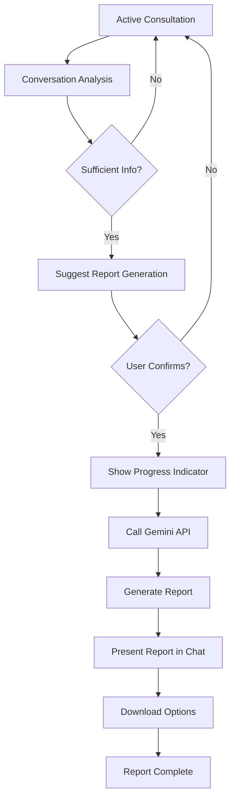

# Automatic Diagnostic Report Generation - Product Requirements Document

## 1. Product Overview

The Automatic Diagnostic Report Generation feature enhances the AI consultation system by intelligently detecting when sufficient medical information has been collected and automatically triggering a comprehensive diagnostic report generation process. This feature empowers users with detailed medical insights while maintaining full user control over the report generation process.

The system addresses the need for comprehensive medical documentation by providing users with professional-grade diagnostic reports based on their consultation conversations, improving healthcare outcomes and providing valuable documentation for further medical consultations.

## 2. Core Features

### 2.1 User Roles

| Role | Registration Method | Core Permissions |
|------|---------------------|------------------|
| Patient | Email registration | Can initiate consultations, generate diagnostic reports, download reports |
| AI Provider | System-managed | Can analyze conversations, suggest report generation, generate diagnostic content |

### 2.2 Feature Module

Our automatic diagnostic report generation requirements consist of the following main components:

1. **Conversation Analysis Engine**: Real-time conversation monitoring, information completeness detection, trigger logic for report suggestions.
2. **User Confirmation Interface**: Report generation suggestion display, user consent collection, progress status updates.
3. **Report Generation System**: Gemini API integration, conversation data processing, diagnostic report compilation.
4. **Report Presentation Interface**: Report display in chat, download functionality, detailed view options.

### 2.3 Page Details

| Page Name | Module Name | Feature description |
|-----------|-------------|---------------------|
| Active Consultation Chat | Conversation Analysis Engine | Monitor conversation flow, analyze information completeness, detect optimal report generation timing |
| Active Consultation Chat | User Confirmation Interface | Display report generation suggestions, collect user consent, show "Generate Report" button with confirmation dialog |
| Active Consultation Chat | Progress Indicator | Show real-time progress during report generation, display status messages, provide estimated completion time |
| Active Consultation Chat | Report Presentation | Display generated report in chat interface, provide download options (PDF/HTML), offer detailed view modal |
| Report Generation API | Gemini Integration | Process conversation data, call Gemini API for report generation, handle API responses and errors |
| Report Storage System | Report Management | Store generated reports, manage report history, provide report retrieval functionality |

## 3. Core Process

### Patient Flow
1. Patient engages in AI consultation conversation
2. System continuously analyzes conversation for completeness
3. When sufficient information is detected, AI suggests generating diagnostic report
4. Patient reviews suggestion and confirms or declines report generation
5. If confirmed, system displays progress indicators during generation
6. Generated report is presented in chat with download options
7. Patient can view detailed report or download for external use

### AI Provider Flow
1. AI provider analyzes ongoing conversation content
2. Evaluates information completeness using predefined criteria
3. Triggers report generation suggestion when threshold is met
4. Processes user confirmation and initiates report generation
5. Sends conversation data to Gemini API for diagnostic analysis
6. Receives and formats generated report for presentation

## 4. User Interface Design

### 4.1 Design