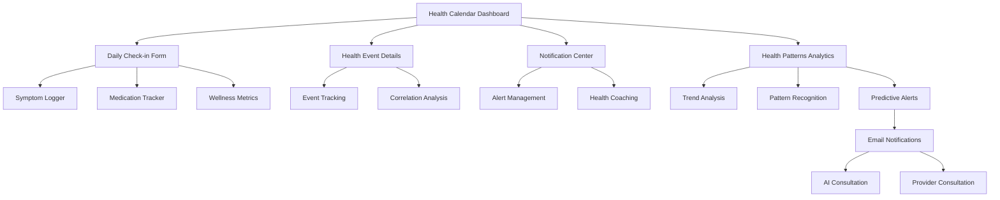

# Daily Health Calendar & Check-in System - Product Requirements Document

## 1. Product Overview

The Daily Health Calendar & Check-in System is an integrated feature within the existing telemedicine platform that enables users to track health-related events, monitor symptom duration, and receive automated health coaching through streak tracking and intelligent notifications. The system automatically triggers email alerts when health issues persist (e.g., headaches for 5+ consecutive days) and provides pattern recognition to enhance early intervention and user engagement.

- **Core Purpose**: Transform reactive healthcare into proactive health management through continuous monitoring and automated intervention alerts.
- **Target Users**: Existing platform users seeking comprehensive health tracking and early warning systems for persistent health issues.
- **Market Value**: Enhances user retention, reduces emergency interventions, and positions the platform as a comprehensive health management ecosystem.

## 2. Core Features

### 2.1 User Roles

| Role | Registration Method | Core Permissions |
|------|---------------------|------------------|
| Patient | Existing Clerk authentication | Full calendar access, check-in tracking, notification preferences |
| Healthcare Provider | Existing provider system | View patient calendar data, access health patterns, receive critical alerts |
| AI Provider | Existing AI system | Access calendar data for consultation context, pattern analysis integration |

### 2.2 Feature Module

Our Daily Health Calendar & Check-in System consists of the following main pages:

1. **Health Calendar Dashboard**: Interactive calendar view, daily check-in interface, streak tracking display, health event visualization.
2. **Daily Check-in Form**: Symptom logging, medication tracking, mood assessment, custom health metrics input.
3. **Health Patterns Analytics**: Trend visualization, pattern recognition insights, correlation analysis, predictive health alerts.
4. **Notification Center**: Alert management, email notification settings, streak milestone celebrations, health coaching messages.
5. **Health Event Details**: Individual event tracking, duration monitoring, severity progression, related symptoms correlation.

### 2.3 Page Details

| Page Name | Module Name | Feature description |
|-----------|-------------|---------------------|
| Health Calendar Dashboard | Calendar View | Display monthly/weekly calendar with color-coded health events, streak indicators, and quick check-in access |
| Health Calendar Dashboard | Streak Tracker | Show current check-in streak, milestone achievements, and gamification elements with progress visualization |
| Health Calendar Dashboard | Quick Actions | One-click symptom logging, medication reminders, and emergency contact access |
| Daily Check-in Form | Symptom Logger | Record symptoms with severity scale (1-10), duration, triggers, and associated factors |
| Daily Check-in Form | Medication Tracker | Log medication intake, dosage, timing, and side effects with reminder system |
| Daily Check-in Form | Wellness Metrics | Track mood, energy levels, sleep quality, and custom health indicators |
| Health Patterns Analytics | Trend Analysis | Visualize health patterns over time with charts, graphs, and correlation insights |
| Health Patterns Analytics | Pattern Recognition | AI-powered detection of recurring patterns, triggers, and health correlations |
| Health Patterns Analytics | Predictive Alerts | Early warning system for potential health issues based on historical data |
| Notification Center | Alert Management | Configure notification preferences, view active alerts, and manage email settings |
| Notification Center | Health Coaching | Receive personalized health tips, streak encouragement, and intervention suggestions |
| Health Event Details | Event Tracking | Monitor individual health events with detailed progression, severity changes, and duration |
| Health Event Details | Correlation Analysis | Identify relationships between symptoms, medications, lifestyle factors, and health outcomes |

## 3. Core Process

### Patient Flow
1. **Daily Check-in**: User accesses calendar dashboard → completes daily health check-in → system updates streak counter
2. **Symptom Logging**: User reports new symptom → system creates health event → tracks duration and severity
3. **Pattern Recognition**: System analyzes health data → identifies concerning patterns → triggers automated alerts
4. **Notification Response**: User receives email alert → accesses detailed health analysis → can schedule AI/provider consultation
5. **Health Coaching**: System provides personalized recommendations → user follows suggestions → tracks improvement

### Provider Flow
1. **Patient Monitoring**: Provider accesses patient calendar data → reviews health patterns → identifies intervention opportunities
2. **Alert Response**: Provider receives critical health alerts → reviews patient data → initiates contact or consultation
3. **Consultation Integration**: Provider uses calendar data during consultations → provides context-aware care → updates treatment plans

## 4. User Interface Design

### 4.1 Design Style

- **Primary Colors**: Medical blue (#2563EB), success green (#10B981), warning amber (#F59E0B), critical red (#EF4444)
- **Secondary Colors**: Neutral grays (#F8FAFC, #E2E8F0, #64748B) for backgrounds and text
- **Button Style**: Rounded corners (8px), subtle shadows, hover animations with color transitions
- **Typography**: Inter font family, 16px base size, clear hierarchy with 14px-24px range
- **Layout Style**: Card-based design with clean spacing, responsive grid system, mobile-first approach
- **Icons**: Lucide React icons for consistency, health-specific iconography (🩺, 📊, 🎯, ⚡)

### 4.2 Page Design Overview

| Page Name | Module Name | UI Elements |
|-----------|-------------|-------------|
| Health Calendar Dashboard | Calendar View | Interactive calendar grid with color-coded dots for health events, hover tooltips, smooth transitions |
| Health Calendar Dashboard | Streak Tracker | Circular progress indicator, achievement badges, animated counters, celebration effects |
| Daily Check-in Form | Symptom Logger | Slider inputs for severity, dropdown menus for symptom types, quick-select buttons |
| Daily Check-in Form | Medication Tracker | Pill icons, time pickers, dosage inputs, reminder toggle switches |
| Health Patterns Analytics | Trend Analysis | Interactive charts (Chart.js), filterable date ranges, export functionality |
| Health Patterns Analytics | Pattern Recognition | Alert cards with severity indicators, expandable details, action buttons |
| Notification Center | Alert Management | Toggle switches, notification cards, priority indicators, timestamp displays |
| Health Event Details | Event Tracking | Timeline view, severity progression charts, duration counters, related event links |

### 4.3 Responsiveness

The system is designed mobile-first with responsive breakpoints at 640px, 768px, and 1024px. Touch-optimized interactions include swipe gestures for calendar navigation, tap-and-hold for quick actions, and finger-friendly button sizing (minimum 44px). The calendar adapts from monthly view on desktop to weekly/daily views on mobile devices.

## 5. Integration Requirements

### 5.1 Existing System Integration

- **Authentication**: Leverage existing Clerk authentication system for seamless user access
- **Database**: Extend current Drizzle schema with new health calendar tables
- **AI Consultation**: Integrate calendar data into AI provider context for enhanced consultations
- **Notifications**: Utilize existing notification queue system for email alerts
- **Subscription**: Align with current Stripe subscription tiers for feature access

### 5.2 Data Synchronization

- **Real-time Updates**: WebSocket integration for live calendar updates and notifications
- **Offline Support**: Local storage for check-ins when offline, sync when connection restored
- **Cross-device Sync**: Ensure calendar data consistency across all user devices
- **Backup & Recovery**: Automated daily backups with point-in-time recovery capabilities

## 6. Automated Health Coaching

### 6.1 Streak Tracking System

- **Daily Check-in Streaks**: Track consecutive days of health logging with milestone rewards
- **Symptom-free Streaks**: Monitor periods without specific symptoms for motivation
- **Medication Adherence**: Track consistent medication intake with adherence scoring
- **Gamification Elements**: Achievement badges, progress levels, and social sharing options

### 6.2 Intelligent Notifications

- **Persistence Alerts**: Automatic emails when symptoms persist beyond threshold (5+ days)
- **Pattern Warnings**: Notifications for concerning health patterns or correlations
- **Medication Reminders**: Smart reminders based on user preferences and adherence history
- **Health Coaching Tips**: Personalized recommendations based on user data and patterns

### 6.3 Early Intervention System

- **Risk Assessment**: AI-powered analysis of health patterns to identify potential issues
- **Provider Alerts**: Automatic notifications to healthcare providers for critical patterns
- **Consultation Recommendations**: Smart suggestions for AI or human provider consultations
- **Emergency Escalation**: Automated escalation protocols for severe or urgent health events