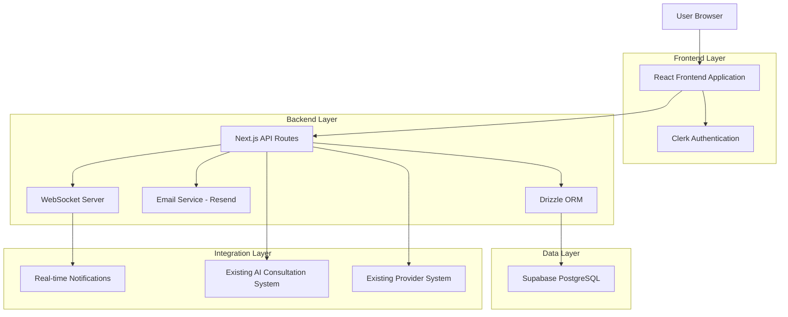
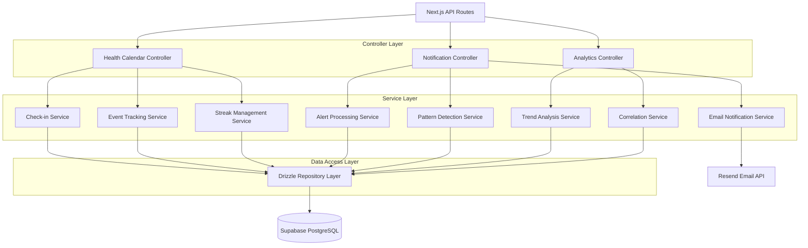
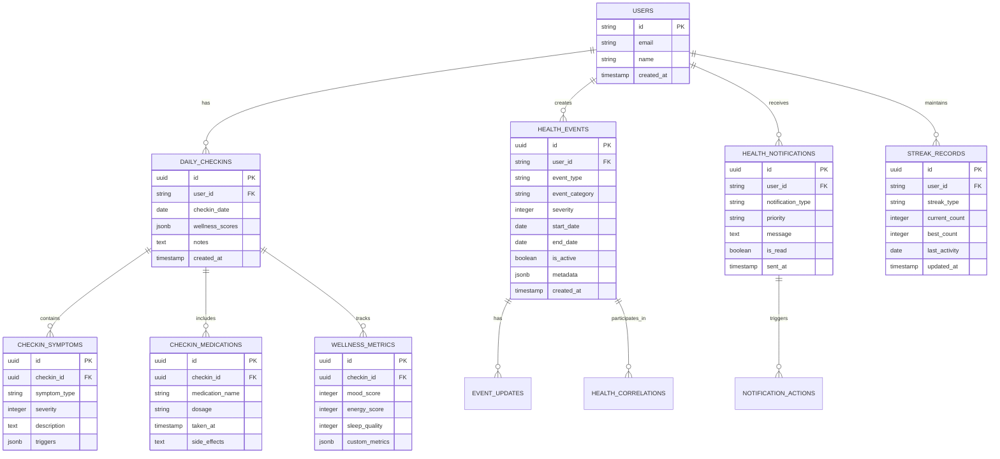

# Daily Health Calendar & Check-in System - Technical Architecture Document

## 1. Architecture Design



## 2. Technology Description

- **Frontend**: React@18 + Next.js@14 + TypeScript + Tailwind CSS + Lucide React Icons
- **Backend**: Next.js API Routes + Drizzle ORM + Node.js
- **Database**: Supabase (PostgreSQL) with existing schema extensions
- **Authentication**: Clerk (existing integration)
- **Real-time**: WebSocket integration for live updates
- **Email**: Resend API for automated notifications
- **Charts**: Chart.js for health analytics visualization
- **State Management**: React Context + Zustand for calendar state

## 3. Route Definitions

| Route | Purpose |
|-------|---------|
| /health-calendar | Main calendar dashboard with daily check-in interface |
| /health-calendar/checkin | Daily check-in form for symptom and wellness logging |
| /health-calendar/analytics | Health patterns and trend analysis page |
| /health-calendar/notifications | Notification center and alert management |
| /health-calendar/event/[id] | Individual health event details and tracking |
| /api/health-calendar/* | API endpoints for calendar operations |
| /api/notifications/health | Health notification management endpoints |
| /api/analytics/health-patterns | Health pattern analysis and insights |

## 4. API Definitions

### 4.1 Core API Endpoints

**Daily Check-in Management**
```
POST /api/health-calendar/checkin
```

Request:
| Param Name | Param Type | isRequired | Description |
|------------|------------|------------|-------------|
| symptoms | array | false | Array of symptom objects with type, severity, notes |
| medications | array | false | Array of medication intake records |
| wellnessMetrics | object | false | Mood, energy, sleep quality scores |
| customMetrics | object | false | User-defined health tracking metrics |

Response:
| Param Name | Param Type | Description |
|------------|------------|-------------|
| success | boolean | Operation status |
| streakCount | number | Updated daily check-in streak |
| checkInId | string | Created check-in record ID |

**Health Event Tracking**
```
POST /api/health-calendar/events
```

Request:
| Param Name | Param Type | isRequired | Description |
|------------|------------|------------|-------------|
| eventType | string | true | Type of health event (symptom, medication, etc.) |
| severity | number | false | Severity scale 1-10 |
| startDate | string | true | Event start date (ISO format) |
| notes | string | false | Additional notes or context |

**Pattern Analysis**
```
GET /api/analytics/health-patterns
```

Query Parameters:
| Param Name | Param Type | isRequired | Description |
|------------|------------|------------|-------------|
| startDate | string | false | Analysis start date |
| endDate | string | false | Analysis end date |
| eventTypes | string | false | Comma-separated event types to analyze |

Response:
| Param Name | Param Type | Description |
|------------|------------|-------------|
| patterns | array | Detected health patterns and correlations |
| alerts | array | Active health alerts requiring attention |
| trends | object | Statistical trends and insights |

**Notification Management**
```
POST /api/notifications/health/configure
```

Request:
| Param Name | Param Type | isRequired | Description |
|------------|------------|------------|-------------|
| persistenceThreshold | number | false | Days before persistence alert (default: 5) |
| emailEnabled | boolean | false | Enable email notifications |
| reminderTimes | array | false | Daily reminder times |
| criticalAlerts | boolean | false | Enable critical health alerts |

## 5. Server Architecture Diagram



## 6. Data Model

### 6.1 Data Model Definition



### 6.2 Data Definition Language

**Daily Check-ins Table**
```sql
-- Daily check-ins tracking
CREATE TABLE daily_checkins (
    id UUID PRIMARY KEY DEFAULT gen_random_uuid(),
    user_id TEXT NOT NULL REFERENCES users(id) ON DELETE CASCADE,
    checkin_date DATE NOT NULL,
    wellness_scores JSONB DEFAULT '{}',
    overall_mood INTEGER CHECK (overall_mood >= 1 AND overall_mood <= 10),
    energy_level INTEGER CHECK (energy_level >= 1 AND energy_level <= 10),
    sleep_quality INTEGER CHECK (sleep_quality >= 1 AND sleep_quality <= 10),
    notes TEXT,
    completed_at TIMESTAMP WITH TIME ZONE DEFAULT NOW(),
    created_at TIMESTAMP WITH TIME ZONE DEFAULT NOW(),
    updated_at TIMESTAMP WITH TIME ZONE DEFAULT NOW()
);

-- Unique constraint for one check-in per user per day
CREATE UNIQUE INDEX idx_daily_checkins_user_date ON daily_checkins(user_id, checkin_date);
CREATE INDEX idx_daily_checkins_date ON daily_checkins(checkin_date DESC);
```

**Health Events Table**
```sql
-- Health events and symptom tracking
CREATE TABLE health_events (
    id UUID PRIMARY KEY DEFAULT gen_random_uuid(),
    user_id TEXT NOT NULL REFERENCES users(id) ON DELETE CASCADE,
    event_type VARCHAR(50) NOT NULL, -- 'symptom', 'medication', 'appointment', 'custom'
    event_category VARCHAR(100) NOT NULL, -- 'headache', 'fever', 'medication_intake'
    title VARCHAR(200) NOT NULL,
    description TEXT,
    severity INTEGER CHECK (severity >= 1 AND severity <= 10),
    start_date DATE NOT NULL,
    end_date DATE,
    is_active BOOLEAN DEFAULT true,
    duration_days INTEGER GENERATED ALWAYS AS (
        CASE WHEN end_date IS NOT NULL 
        THEN end_date - start_date + 1 
        ELSE CURRENT_DATE - start_date + 1 END
    ) STORED,
    triggers JSONB DEFAULT '[]',
    related_factors JSONB DEFAULT '{}',
    metadata JSONB DEFAULT '{}',
    created_at TIMESTAMP WITH TIME ZONE DEFAULT NOW(),
    updated_at TIMESTAMP WITH TIME ZONE DEFAULT NOW()
);

CREATE INDEX idx_health_events_user_id ON health_events(user_id);
CREATE INDEX idx_health_events_type_category ON health_events(event_type, event_category);
CREATE INDEX idx_health_events_active ON health_events(user_id, is_active, start_date DESC);
CREATE INDEX idx_health_events_duration ON health_events(user_id, duration_days DESC) WHERE is_active = true;
```

**Check-in Symptoms Table**
```sql
-- Symptoms logged during daily check-ins
CREATE TABLE checkin_symptoms (
    id UUID PRIMARY KEY DEFAULT gen_random_uuid(),
    checkin_id UUID NOT NULL REFERENCES daily_checkins(id) ON DELETE CASCADE,
    health_event_id UUID REFERENCES health_events(id) ON DELETE SET NULL,
    symptom_type VARCHAR(100) NOT NULL,
    severity INTEGER NOT NULL CHECK (severity >= 1 AND severity <= 10),
    description TEXT,
    triggers JSONB DEFAULT '[]',
    location VARCHAR(100),
    duration_hours DECIMAL(4,2),
    created_at TIMESTAMP WITH TIME ZONE DEFAULT NOW()
);

CREATE INDEX idx_checkin_symptoms_checkin_id ON checkin_symptoms(checkin_id);
CREATE INDEX idx_checkin_symptoms_type ON checkin_symptoms(symptom_type);
```

**Check-in Medications Table**
```sql
-- Medications logged during daily check-ins
CREATE TABLE checkin_medications (
    id UUID PRIMARY KEY DEFAULT gen_random_uuid(),
    checkin_id UUID NOT NULL REFERENCES daily_checkins(id) ON DELETE CASCADE,
    medication_name VARCHAR(200) NOT NULL,
    dosage VARCHAR(100),
    dosage_amount DECIMAL(10,2),
    dosage_unit VARCHAR(20),
    taken_at TIMESTAMP WITH TIME ZONE NOT NULL,
    prescribed_time TIME,
    adherence_status VARCHAR(20) DEFAULT 'on_time', -- 'on_time', 'late', 'missed', 'early'
    side_effects TEXT,
    effectiveness_rating INTEGER CHECK (effectiveness_rating >= 1 AND effectiveness_rating <= 10),
    notes TEXT,
    created_at TIMESTAMP WITH TIME ZONE DEFAULT NOW()
);

CREATE INDEX idx_checkin_medications_checkin_id ON checkin_medications(checkin_id);
CREATE INDEX idx_checkin_medications_name ON checkin_medications(medication_name);
CREATE INDEX idx_checkin_medications_taken_at ON checkin_medications(taken_at DESC);
```

**Health Notifications Table**
```sql
-- Health-related notifications and alerts
CREATE TABLE health_notifications (
    id UUID PRIMARY KEY DEFAULT gen_random_uuid(),
    user_id TEXT NOT NULL REFERENCES users(id) ON DELETE CASCADE,
    notification_type VARCHAR(50) NOT NULL, -- 'persistence_alert', 'pattern_warning', 'reminder', 'milestone'
    priority VARCHAR(20) DEFAULT 'medium', -- 'low', 'medium', 'high', 'critical'
    title VARCHAR(200) NOT NULL,
    message TEXT NOT NULL,
    health_event_id UUID REFERENCES health_events(id) ON DELETE SET NULL,
    trigger_data JSONB DEFAULT '{}',
    action_required BOOLEAN DEFAULT false,
    action_url VARCHAR(500),
    is_read BOOLEAN DEFAULT false,
    is_email_sent BOOLEAN DEFAULT false,
    email_sent_at TIMESTAMP WITH TIME ZONE,
    read_at TIMESTAMP WITH TIME ZONE,
    expires_at TIMESTAMP WITH TIME ZONE,
    created_at TIMESTAMP WITH TIME ZONE DEFAULT NOW()
);

CREATE INDEX idx_health_notifications_user_id ON health_notifications(user_id, created_at DESC);
CREATE INDEX idx_health_notifications_unread ON health_notifications(user_id, is_read, priority);
CREATE INDEX idx_health_notifications_type ON health_notifications(notification_type, created_at DESC);
```

**Streak Records Table**
```sql
-- User streak tracking for gamification
CREATE TABLE streak_records (
    id UUID PRIMARY KEY DEFAULT gen_random_uuid(),
    user_id TEXT NOT NULL REFERENCES users(id) ON DELETE CASCADE,
    streak_type VARCHAR(50) NOT NULL, -- 'daily_checkin', 'symptom_free', 'medication_adherence'
    current_count INTEGER DEFAULT 0,
    best_count INTEGER DEFAULT 0,
    last_activity_date DATE,
    streak_start_date DATE,
    is_active BOOLEAN DEFAULT true,
    milestone_rewards JSONB DEFAULT '[]',
    created_at TIMESTAMP WITH TIME ZONE DEFAULT NOW(),
    updated_at TIMESTAMP WITH TIME ZONE DEFAULT NOW()
);

CREATE UNIQUE INDEX idx_streak_records_user_type ON streak_records(user_id, streak_type);
CREATE INDEX idx_streak_records_active ON streak_records(user_id, is_active, current_count DESC);
```

**Health Pattern Analysis Table**
```sql
-- AI-detected health patterns and correlations
CREATE TABLE health_patterns (
    id UUID PRIMARY KEY DEFAULT gen_random_uuid(),
    user_id TEXT NOT NULL REFERENCES users(id) ON DELETE CASCADE,
    pattern_type VARCHAR(50) NOT NULL, -- 'correlation', 'trend', 'anomaly', 'prediction'
    pattern_name VARCHAR(200) NOT NULL,
    description TEXT,
    confidence_score DECIMAL(3,2) CHECK (confidence_score >= 0 AND confidence_score <= 1),
    related_events JSONB DEFAULT '[]',
    statistical_data JSONB DEFAULT '{}',
    recommendations JSONB DEFAULT '[]',
    is_active BOOLEAN DEFAULT true,
    detected_at TIMESTAMP WITH TIME ZONE DEFAULT NOW(),
    last_updated TIMESTAMP WITH TIME ZONE DEFAULT NOW()
);

CREATE INDEX idx_health_patterns_user_id ON health_patterns(user_id, detected_at DESC);
CREATE INDEX idx_health_patterns_type ON health_patterns(pattern_type, confidence_score DESC);
```

**Initial Data and Triggers**
```sql
-- Function to update streak records
CREATE OR REPLACE FUNCTION update_streak_record(p_user_id TEXT, p_streak_type VARCHAR(50))
RETURNS INTEGER AS $$
DECLARE
    current_streak INTEGER := 0;
    last_date DATE;
BEGIN
    -- Get current streak record
    SELECT current_count, last_activity_date INTO current_streak, last_date
    FROM streak_records 
    WHERE user_id = p_user_id AND streak_type = p_streak_type;
    
    -- If no record exists, create one
    IF NOT FOUND THEN
        INSERT INTO streak_records (user_id, streak_type, current_count, best_count, last_activity_date, streak_start_date)
        VALUES (p_user_id, p_streak_type, 1, 1, CURRENT_DATE, CURRENT_DATE);
        RETURN 1;
    END IF;
    
    -- Check if streak continues (consecutive days)
    IF last_date = CURRENT_DATE - INTERVAL '1 day' THEN
        current_streak := current_streak + 1;
    ELSIF last_date < CURRENT_DATE - INTERVAL '1 day' THEN
        current_streak := 1; -- Reset streak
    ELSE
        RETURN current_streak; -- Same day, no change
    END IF;
    
    -- Update streak record
    UPDATE streak_records 
    SET current_count = current_streak,
        best_count = GREATEST(best_count, current_streak),
        last_activity_date = CURRENT_DATE,
        streak_start_date = CASE WHEN current_streak = 1 THEN CURRENT_DATE ELSE streak_start_date END,
        updated_at = NOW()
    WHERE user_id = p_user_id AND streak_type = p_streak_type;
    
    RETURN current_streak;
END;
$$ LANGUAGE plpgsql;

-- Trigger to update streaks on daily check-in
CREATE OR REPLACE FUNCTION trigger_update_checkin_streak()
RETURNS TRIGGER AS $$
BEGIN
    PERFORM update_streak_record(NEW.user_id, 'daily_checkin');
    RETURN NEW;
END;
$$ LANGUAGE plpgsql;

CREATE TRIGGER update_checkin_streak_trigger
    AFTER INSERT ON daily_checkins
    FOR EACH ROW
    EXECUTE FUNCTION trigger_update_checkin_streak();
```

## 7. Integration Points

### 7.1 Existing System Integration

- **AI Consultations**: Calendar data accessible via `aiConsultations.metadata` for enhanced context
- **Provider Dashboard**: Health patterns visible in provider interface for better patient care
- **Notification Queue**: Leverage existing `notificationQueue` table for email delivery
- **User Analytics**: Extend `userAnalytics` to include calendar engagement metrics
- **WebSocket**: Use existing `websocketConnections` for real-time calendar updates

### 7.2 Email Notification Integration

```typescript
// Email notification service integration
interface HealthNotificationEmail {
  userId: string;
  notificationType: 'persistence_alert' | 'pattern_warning' | 'milestone';
  healthEventId?: string;
  templateData: {
    userName: string;
    eventType: string;
    duration: number;
    severity: number;
    recommendations: string[];
  };
}
```

### 7.3 Real-time Updates

```typescript
// WebSocket event types for calendar updates
type CalendarWebSocketEvent = 
  | { type: 'CHECKIN_COMPLETED'; data: { userId: string; streakCount: number } }
  | { type: 'HEALTH_ALERT_TRIGGERED'; data: { userId: string; alertType: string } }
  | { type: 'PATTERN_DETECTED'; data: { userId: string; patternType: string } }
  | { type: 'STREAK_MILESTONE'; data: { userId: string; milestone: number } };
```