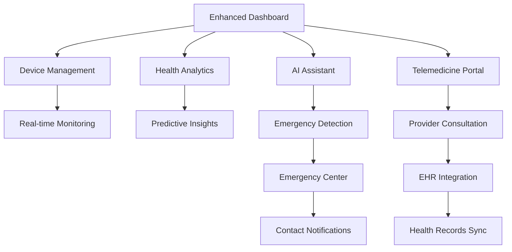

# Game-Changing Features Implementation Document

## MediScope AI Enhancement Strategy

## 1. Product Overview

This document outlines the implementation strategy for 6 game-changing features that will transform MediScope AI from a basic symptom checker into a comprehensive healthcare ecosystem. These features will leverage the existing React/Next.js architecture, Clerk authentication, Gemini AI integration, and current dashboard/health-check components to create a revolutionary healthcare platform.

## 2. Core Features

### 2.1 User Roles

| Role                | Registration Method                    | Core Permissions                                                     |
| ------------------- | -------------------------------------- | -------------------------------------------------------------------- |
| Patient             | Email/OAuth via Clerk                  | Access all personal health features, emergency contacts, device sync |
| Healthcare Provider | Professional verification + invitation | Access patient data (with consent), telemedicine, EHR integration    |
| Emergency Contact   | Invitation from patient                | Receive emergency alerts, view basic health status                   |
| System Admin        | Internal invitation                    | Manage platform, monitor compliance, system analytics                |

### 2.2 Feature Module

Our enhanced MediScope AI will consist of the following main features:

1. **Real-time AI Symptom Analysis**: Continuous health monitoring with instant alerts and recommendations
2. **Wearable Device Integration**: Seamless sync with Apple Health, Fitbit, and other health devices
3. **Predictive Health Analytics**: ML-powered health trend analysis and risk prediction
4. **Telemedicine Platform**: Integrated video consultations with healthcare providers
5. **Emergency Contact Integration**: Automated emergency alerts and contact management
6. **EHR Sync**: Secure integration with healthcare provider systems and electronic health records

### 2.3 Page Details

| Page Name             | Module Name              | Feature Description                                                                     |
| --------------------- | ------------------------ | --------------------------------------------------------------------------------------- |
| Enhanced Dashboard    | Real-time Health Monitor | Display live health metrics, alerts, device status, and predictive insights             |
| Device Management     | Wearable Integration Hub | Connect, sync, and manage health devices with real-time data visualization              |
| Health Analytics      | Predictive Dashboard     | Show health trends, risk scores, and AI-powered predictions with interactive charts     |
| Telemedicine Portal   | Video Consultation       | Schedule, conduct, and manage video calls with healthcare providers                     |
| Emergency Center      | Emergency Management     | Configure emergency contacts, view alert history, and panic button access               |
| EHR Integration       | Health Records Sync      | Connect with healthcare providers, sync medical records, and manage data sharing        |
| Enhanced AI Assistant | Advanced Health Chat     | Upgraded chat with real-time analysis, device data integration, and emergency detection |

## 3. Core Process

### Patient Flow

1. **Onboarding**: Patient registers → connects devices → sets emergency contacts → completes health profile
2. **Daily Monitoring**: Continuous device sync → real-time AI analysis → predictive insights → alerts if needed
3. **Health Check**: Symptom input → AI analysis with device data → generate comprehensive report → share with providers
4. **Emergency Scenario**: Critical reading detected → emergency contacts notified → healthcare providers alerted → telemedicine session initiated
5. **Provider Consultation**: Schedule appointment → video consultation → EHR data shared → follow-up recommendations

### Healthcare Provider Flow

1. **Registration**: Professional verification → platform access → patient connection requests
2. **Patient Management**: Review patient data → analyze trends → schedule consultations → update EHR
3. **Telemedicine**: Conduct video sessions → access real-time patient data → provide recommendations → update records



## 4. Technical Implementation

### 4.1 Database Schema Extensions

```sql
-- Device Integration
CREATE TABLE device_connections (
  id VARCHAR PRIMARY KEY,
  user_id VARCHAR REFERENCES users(id),
  device_type VARCHAR NOT NULL, -- 'apple_health', 'fitbit', 'garmin'
  device_id VARCHAR NOT NULL,
  access_token TEXT,
  refresh_token TEXT,
  last_sync TIMESTAMP,
  is_active BOOLEAN DEFAULT true,
  created_at TIMESTAMP DEFAULT NOW()
);

CREATE TABLE biometric_data (
  id VARCHAR PRIMARY KEY,
  user_id VARCHAR REFERENCES users(id),
  device_id VARCHAR REFERENCES device_connections(id),
  metric_type VARCHAR NOT NULL, -- 'heart_rate', 'blood_pressure', 'steps'
  value DECIMAL NOT NULL,
  unit VARCHAR NOT NULL,
  recorded_at TIMESTAMP NOT NULL,
  created_at TIMESTAMP DEFAULT NOW()
);

-- Emergency Contacts
CREATE TABLE emergency_contacts (
  id VARCHAR PRIMARY KEY,
  user_id VARCHAR REFERENCES users(id),
  contact_name VARCHAR NOT NULL,
  contact_email VARCHAR,
  contact_phone VARCHAR,
  relationship VARCHAR,
  priority_order INTEGER,
  is_active BOOLEAN DEFAULT true,
  created_at TIMESTAMP DEFAULT NOW()
);

CREATE TABLE emergency_alerts (
  id VARCHAR PRIMARY KEY,
  user_id VARCHAR REFERENCES users(id),
  alert_type VARCHAR NOT NULL, -- 'critical_reading', 'panic_button', 'no_response'
  severity VARCHAR NOT NULL, -- 'low', 'medium', 'high', 'critical'
  message TEXT,
  contacts_notified JSONB,
  resolved_at TIMESTAMP,
  created_at TIMESTAMP DEFAULT NOW()
);

-- Predictive Analytics
CREATE TABLE health_predictions (
  id VARCHAR PRIMARY KEY,
  user_id VARCHAR REFERENCES users(id),
  prediction_type VARCHAR NOT NULL, -- 'risk_score', 'trend_analysis', 'anomaly_detection'
  prediction_data JSONB NOT NULL,
  confidence_score DECIMAL,
  valid_until TIMESTAMP,
  created_at TIMESTAMP DEFAULT NOW()
);

-- Telemedicine
CREATE TABLE healthcare_providers (
  id VARCHAR PRIMARY KEY,
  user_id VARCHAR REFERENCES users(id),
  license_number VARCHAR NOT NULL,
  specialty VARCHAR,
  verification_status VARCHAR DEFAULT 'pending',
  practice_name VARCHAR,
  created_at TIMESTAMP DEFAULT NOW()
);

CREATE TABLE telemedicine_appointments (
  id VARCHAR PRIMARY KEY,
  patient_id VARCHAR REFERENCES users(id),
  provider_id VARCHAR REFERENCES healthcare_providers(id),
  scheduled_at TIMESTAMP NOT NULL,
  duration_minutes INTEGER DEFAULT 30,
  status VARCHAR DEFAULT 'scheduled', -- 'scheduled', 'in_progress', 'completed', 'cancelled'
  meeting_room_id VARCHAR,
  notes TEXT,
  created_at TIMESTAMP DEFAULT NOW()
);

-- EHR Integration
CREATE TABLE ehr_connections (
  id VARCHAR PRIMARY KEY,
  user_id VARCHAR REFERENCES users(id),
  provider_system VARCHAR NOT NULL, -- 'epic', 'cerner', 'allscripts'
  connection_status VARCHAR DEFAULT 'pending',
  last_sync TIMESTAMP,
  sync_permissions JSONB,
  created_at TIMESTAMP DEFAULT NOW()
);
```

### 4.2 API Endpoints

```typescript
// Device Integration APIs
POST /api/devices/connect - Connect new device
GET /api/devices/list - List connected devices
POST /api/devices/sync - Manual sync device data
DELETE /api/devices/{deviceId} - Disconnect device
GET /api/biometrics/{userId} - Get biometric data
POST /api/biometrics/realtime - Receive real-time data

// Emergency APIs
POST /api/emergency/contacts - Add emergency contact
GET /api/emergency/contacts - List emergency contacts
POST /api/emergency/alert - Trigger emergency alert
GET /api/emergency/alerts/history - Get alert history
POST /api/emergency/panic - Panic button endpoint

// Predictive Analytics APIs
GET /api/analytics/predictions - Get health predictions
POST /api/analytics/generate - Generate new predictions
GET /api/analytics/trends - Get health trends
GET /api/analytics/risk-score - Get current risk score

// Telemedicine APIs
POST /api/telemedicine/appointments - Schedule appointment
GET /api/telemedicine/appointments - List appointments
POST /api/telemedicine/join/{appointmentId} - Join video call
POST /api/telemedicine/end/{appointmentId} - End consultation
GET /api/providers/search - Search healthcare providers

// EHR Integration APIs
POST /api/ehr/connect - Connect to EHR system
GET /api/ehr/records - Get medical records
POST /api/ehr/sync - Sync with EHR system
POST /api/ehr/share - Share data with provider

// Enhanced AI APIs
POST /api/ai/realtime-analysis - Real-time symptom analysis
POST /api/ai/emergency-detection - Emergency situation detection
POST /api/ai/predictive-analysis - Generate health predictions
POST /api/ai/device-integration - Analyze device data
```

### 4.3 Component Architecture

```typescript
// Enhanced Dashboard Components
src/components/dashboard/
├── RealTimeHealthMonitor.tsx - Live health metrics display
├── DeviceStatusWidget.tsx - Connected devices overview
├── PredictiveInsights.tsx - AI predictions and trends
├── EmergencyQuickAccess.tsx - Panic button and emergency info
├── UpcomingAppointments.tsx - Telemedicine schedule
└── HealthTrendChart.tsx - Interactive health data visualization

// Device Management Components
src/components/devices/
├── DeviceConnectionWizard.tsx - Device setup flow
├── DeviceList.tsx - Manage connected devices
├── BiometricDataViewer.tsx - Real-time data display
├── SyncStatus.tsx - Sync status and controls
└── DevicePermissions.tsx - Manage device permissions

// Emergency Components
src/components/emergency/
├── EmergencyContactManager.tsx - Manage emergency contacts
├── PanicButton.tsx - Emergency alert trigger
├── AlertHistory.tsx - View past emergency alerts
└── EmergencySettings.tsx - Configure emergency preferences

// Telemedicine Components
src/components/telemedicine/
├── AppointmentScheduler.tsx - Schedule consultations
├── VideoCallInterface.tsx - Video consultation UI
├── ProviderSearch.tsx - Find healthcare providers
├── ConsultationHistory.tsx - Past consultation records
└── MeetingRoom.tsx - Video call room component

// Analytics Components
src/components/analytics/
├── PredictiveHealthDashboard.tsx - Main analytics view
├── RiskScoreDisplay.tsx - Current health risk visualization
├── HealthTrendAnalysis.tsx - Trend analysis charts
├── AnomalyDetection.tsx - Unusual pattern alerts
└── HealthInsights.tsx - AI-generated health insights

// EHR Components
src/components/ehr/
├── EHRConnectionManager.tsx - Manage EHR connections
├── MedicalRecordsViewer.tsx - View synced records
├── DataSharingControls.tsx - Control data sharing
└── ProviderDataAccess.tsx - Manage provider access
```

### 4.4 Real-time Infrastructure

```typescript
// WebSocket Implementation
src/lib/websocket/
├── healthMonitorSocket.ts - Real-time health monitoring
├── emergencyAlertSocket.ts - Emergency alert system
├── deviceDataSocket.ts - Live device data streaming
└── consultationSocket.ts - Telemedicine communication

// Background Jobs
src/lib/jobs/
├── deviceSyncJob.ts - Periodic device data sync
├── healthAnalysisJob.ts - Continuous health analysis
├── predictionUpdateJob.ts - Update health predictions
├── emergencyMonitorJob.ts - Monitor for emergency conditions
└── ehrSyncJob.ts - Sync with EHR systems
```

## 5. Implementation Phases

### Phase 1: Foundation (Months 1-2)

**Priority: High**

* Set up WebSocket infrastructure for real-time communication

* Implement device connection APIs (Apple Health, Fitbit)

* Create basic emergency contact management

* Extend existing AI analysis for real-time processing

* Add biometric data storage and basic visualization

**Deliverables:**

* Real-time health monitoring dashboard

* Device connection wizard

* Emergency contact management

* Enhanced AI analysis with device data

### Phase 2: Analytics & Prediction (Months 3-4)

**Priority: High**

* Implement machine learning models for health prediction

* Create predictive analytics dashboard

* Add anomaly detection for emergency situations

* Develop health trend analysis

* Integrate predictive insights into existing reports

**Deliverables:**

* Predictive health analytics dashboard

* Risk score calculation system

* Automated emergency detection

* Health trend visualization

### Phase 3: Professional Integration (Months 5-6)

**Priority: Medium**

* Build telemedicine platform with video calling

* Implement healthcare provider verification system

* Create appointment scheduling system

* Add EHR integration capabilities

* Develop provider dashboard

**Deliverables:**

* Complete telemedicine platform

* Healthcare provider portal

* EHR integration system

* Appointment management system

### Phase 4: Advanced Features (Months 7-8)

**Priority: Medium**

* Advanced AI features (drug interaction checking, symptom correlation)

* Multi-device data fusion and analysis

* Advanced emergency response workflows

* Comprehensive reporting and analytics

* Mobile app optimization

**Deliverables:**

* Advanced AI health assistant

* Comprehensive health reports

* Mobile-optimized experience

* Advanced emergency workflows

## 6. Security & Compliance

### 6.1 HIPAA Compliance

* End-to-end encryption for all health data

* Audit logging for all data access

* Role-based access control

* Data retention and deletion policies

* Business Associate Agreements (BAAs) with third parties

### 6.2 Data Security

* OAuth 2.0 for device integrations

* JWT tokens for API authentication

* AES-256 encryption for data at rest

* TLS 1.3 for data in transit

* <br />

