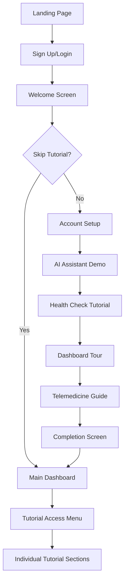

# Onboarding Tutorial System for Telemedicine Platform

## 1. Product Overview

An interactive, step-by-step onboarding tutorial system designed to guide new users through the comprehensive telemedicine platform. The tutorial introduces users to AI-powered health consultations, diagnostic report generation, real-time health monitoring, and virtual appointments with healthcare providers, ensuring smooth user adoption and reduced learning curve.

## 2. Core Features

### 2.1 User Roles

| Role | Registration Method | Core Permissions |
|------|---------------------|------------------|
| New Patient | Email/Social registration via Clerk | Access to guided tutorial, AI consultations, health checks |
| Returning Patient | Existing account login | Skip tutorial option, full platform access |
| Healthcare Provider | Provider registration form | Provider dashboard, patient management, consultation handling |

### 2.2 Feature Module

Our onboarding tutorial system consists of the following main components:

1. **Welcome & Setup**: User authentication, profile completion, platform overview
2. **AI Health Assistant Tour**: Interactive guide through AI consultation features
3. **Health Check Demo**: Hands-on experience with diagnostic tools and report generation
4. **Dashboard Navigation**: Comprehensive tour of user dashboard and health monitoring
5. **Telemedicine Features**: Virtual consultation booking and provider interaction
6. **Progress Tracking**: Tutorial completion status and achievement system

### 2.3 Page Details

| Page Name | Module Name | Feature description |
|-----------|-------------|---------------------|
| Welcome Screen | Tutorial Introduction | Display platform overview, benefits, estimated completion time. Show progress indicator and skip option. |
| Account Setup | Profile Completion | Guide through Clerk authentication, basic health information input, notification preferences setup. |
| AI Assistant Demo | Interactive Consultation | Simulate AI consultation flow, demonstrate symptom input, show diagnostic data collection, display sample report generation. |
| Health Check Tutorial | Diagnostic Tools | Walk through HealthDataInput component, demonstrate real-time monitoring, show RealtimeDashboard features, explain health alerts. |
| Dashboard Tour | Navigation Guide | Highlight key dashboard sections, explain health reports history, demonstrate search and filter functions, show statistics overview. |
| Telemedicine Guide | Provider Interaction | Demonstrate appointment booking, show provider selection, explain consultation types, preview video call interface. |
| Completion Screen | Achievement Summary | Display tutorial completion badge, provide quick access shortcuts, offer advanced features preview, collect feedback. |

## 3. Core Process

**New User Onboarding Flow:**

1. User lands on platform and creates account via Clerk authentication
2. Welcome screen presents tutorial option with estimated 5-7 minute completion time
3. Profile setup guides through basic health information and preferences
4. AI Assistant demo simulates a consultation with sample symptoms
5. Health check tutorial demonstrates diagnostic tools and real-time monitoring
6. Dashboard tour highlights key navigation and features
7. Telemedicine guide shows appointment booking and provider interaction
8. Completion screen provides achievement badge and quick access shortcuts

**Returning User Flow:**

1. User logs in and sees optional tutorial reminder
2. Can access specific tutorial sections for new features
3. Progress tracking shows completed and remaining sections

## 4. User Interface Design

### 4.1 Design Style

- **Primary Colors**: Blue (#3B82F6) for medical trust, Green (#10B981) for health positivity
- **Secondary Colors**: Gray (#6B7280) for text, White (#FFFFFF) for backgrounds
- **Button Style**: Rounded corners (8px), subtle shadows, hover animations
- **Typography**: Inter font family, 16px base size, clear hierarchy
- **Layout Style**: Card-based design with clean spacing, responsive grid system
- **Icons**: Lucide React icons for consistency, medical-themed illustrations
- **Animations**: Smooth transitions (300ms), progress indicators, gentle hover effects

### 4.2 Page Design Overview

| Page Name | Module Name | UI Elements |
|-----------|-------------|-------------|
| Welcome Screen | Tutorial Introduction | Hero section with medical illustration, progress bar (0/6 steps), "Start Tutorial" CTA button, "Skip" option link |
| Account Setup | Profile Completion | Step indicator, form fields with validation, "Continue" button, back navigation |
| AI Assistant Demo | Interactive Consultation | Chat interface mockup, typing indicators, sample messages, "Try It" interactive elements |
| Health Check Tutorial | Diagnostic Tools | Interactive HealthDataInput form, live RealtimeDashboard preview, tooltip explanations |
| Dashboard Tour | Navigation Guide | Highlighted sections with overlay tooltips, "Next" navigation, mini-map indicator |
| Telemedicine Guide | Provider Interaction | Provider cards showcase, booking calendar preview, video call interface mockup |
| Completion Screen | Achievement Summary | Success animation, completion badge, feature shortcuts grid, feedback form |

### 4.3 Responsiveness

Desktop-first approach with mobile-adaptive design. Touch interaction optimization for mobile devices including:
- Larger touch targets (44px minimum)
- Swipe gestures for tutorial navigation
- Collapsible sections for smaller screens
- Progressive disclosure of information

## 5. Interactive Tutorial Components

### 5.1 Tutorial Overlay System

- **Spotlight Effect**: Highlight specific UI elements with darkened overlay
- **Tooltip Positioning**: Smart positioning to avoid screen edges
- **Navigation Controls**: Previous/Next buttons, step indicators, exit option
- **Progress Tracking**: Visual progress bar and step completion indicators

### 5.2 Guided Interactions

- **Click Simulation**: Animated cursor showing where to click
- **Form Assistance**: Pre-filled sample data with explanations
- **Feature Demonstrations**: Live previews of platform capabilities
- **Interactive Hotspots**: Clickable areas with detailed explanations

### 5.3 Tutorial State Management

- **Progress Persistence**: Save tutorial progress across sessions
- **Skip Options**: Allow users to skip individual sections
- **Restart Capability**: Option to restart tutorial from any point
- **Completion Tracking**: Mark completed sections and overall progress

## 6. Integration Points

### 6.1 Existing Component Integration

- **Clerk Authentication**: Seamless integration with existing auth flow
- **Dashboard Components**: Utilize existing DashboardOverview and RealtimeDashboard
- **AI Consultation**: Integration with ActiveConsultationChat component
- **Health Data**: Connection to HealthDataInput and diagnostic systems
- **Telemedicine**: Integration with AppointmentBooking and provider systems

### 6.2 API Integration

- **Tutorial Progress API**: Track and persist user tutorial progress
- **Sample Data API**: Provide realistic demo data for tutorial interactions
- **Feature Flags**: Control tutorial visibility and content updates
- **Analytics Integration**: Track tutorial completion rates and user engagement

## 7. Tutorial Content Strategy

### 7.1 Educational Approach

- **Progressive Disclosure**: Introduce features gradually to avoid overwhelm
- **Contextual Help**: Provide relevant information at the right moment
- **Visual Learning**: Use animations and illustrations to explain concepts
- **Hands-on Practice**: Allow users to interact with actual platform features

### 7.2 Content Personalization

- **Role-based Content**: Different tutorial paths for patients vs providers
- **Experience Level**: Adjust complexity based on user's technical comfort
- **Feature Interest**: Customize tutorial based on user's primary interests
- **Time Constraints**: Offer quick tour vs comprehensive tutorial options

## 8. Success Metrics

### 8.1 Completion Metrics

- Tutorial completion rate (target: >70%)
- Time to complete tutorial (target: 5-7 minutes)
- Section-specific completion rates
- User drop-off points identification

### 8.2 Engagement Metrics

- Feature adoption rate post-tutorial
- User retention after onboarding
- Support ticket reduction
- User satisfaction scores

### 8.3 Business Impact

- Increased user activation rate
- Reduced time to first consultation
- Higher platform engagement
- Improved user lifetime value

## 9. Implementation Phases

### Phase 1: Core Tutorial Framework
- Tutorial overlay system
- Progress tracking
- Basic navigation
- Welcome and completion screens

### Phase 2: Feature-Specific Tutorials
- AI consultation demo
- Health check walkthrough
- Dashboard tour
- Telemedicine guide

### Phase 3: Advanced Features
- Personalization engine
- Analytics integration
- A/B testing framework
- Multi-language support

### Phase 4: Optimization
- Performance improvements
- Mobile experience enhancement
- Accessibility compliance
- Advanced analytics

## 10. Technical Considerations

### 10.1 Performance

- Lazy loading of tutorial assets
- Minimal impact on main application performance
- Efficient state management
- Optimized animations and transitions

### 10.2 Accessibility

- Screen reader compatibility
- Keyboard navigation support
- High contrast mode support
- Focus management during tutorial

### 10.3 Browser Compatibility

- Modern browser support (Chrome, Firefox, Safari, Edge)
- Graceful degradation for older browsers
- Mobile browser optimization
-