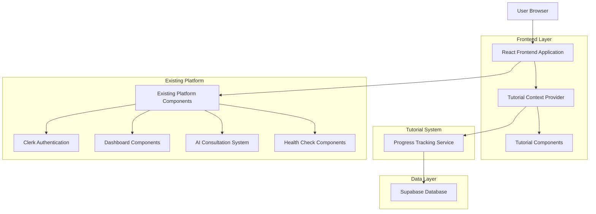
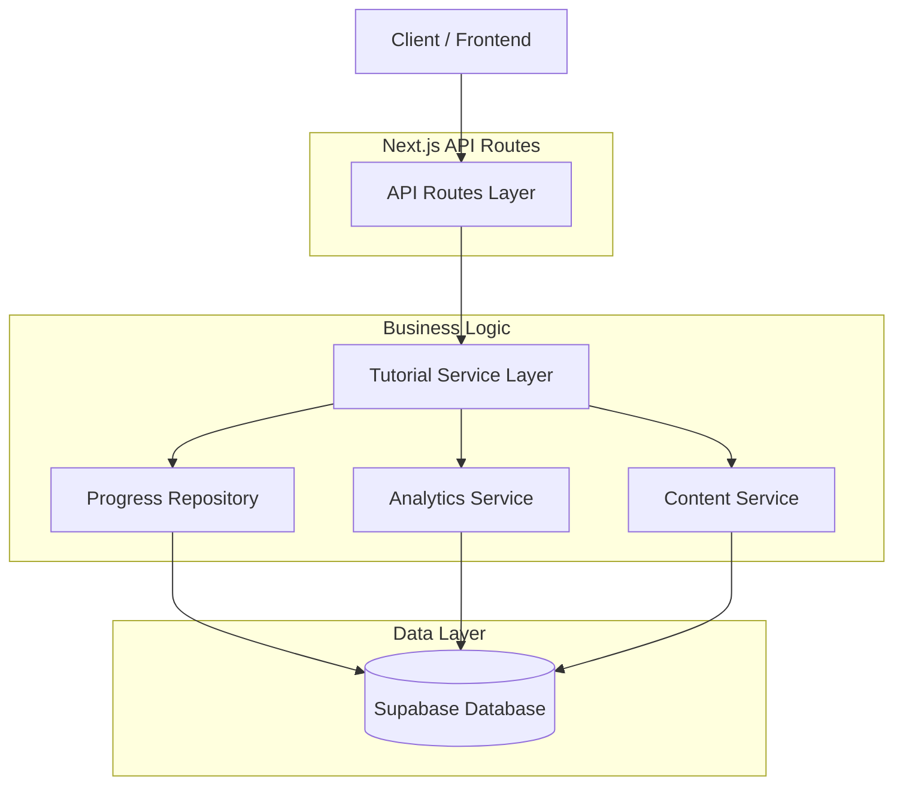
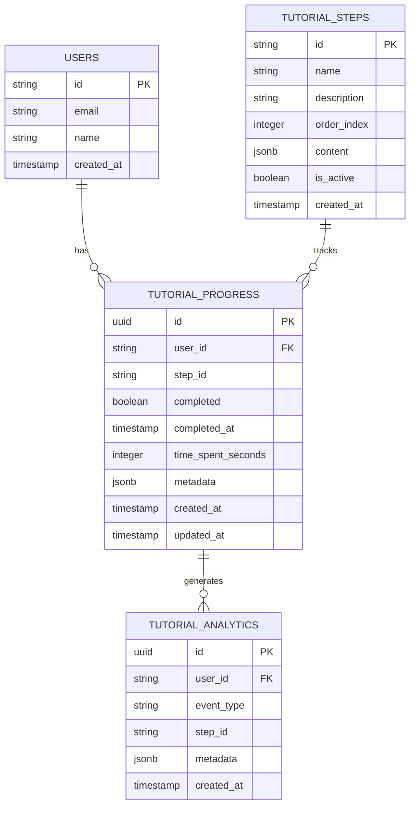

# Technical Architecture for Onboarding Tutorial System

## 1. Architecture Design



## 2. Technology Description

- Frontend: React@18 + TypeScript + Tailwind CSS + Framer Motion + Lucide React
- State Management: React Context API + Custom Hooks
- Database: Supabase (PostgreSQL)
- Authentication: Clerk (existing integration)
- Animations: Framer Motion for smooth transitions
- Icons: Lucide React (consistent with existing platform)

## 3. Route Definitions

| Route | Purpose |
|-------|---------|
| /onboarding | Main onboarding tutorial entry point |
| /onboarding/welcome | Welcome screen and tutorial introduction |
| /onboarding/setup | Account setup and profile completion |
| /onboarding/ai-demo | AI assistant consultation demonstration |
| /onboarding/health-check | Health check and diagnostic tools tutorial |
| /onboarding/dashboard | Dashboard navigation and features tour |
| /onboarding/telemedicine | Telemedicine and appointment booking guide |
| /onboarding/complete | Tutorial completion and achievement screen |

## 4. API Definitions

### 4.1 Core API

**Tutorial Progress Management**

```
GET /api/tutorial/progress
```

Response:
| Param Name | Param Type | Description |
|------------|------------|-------------|
| userId | string | User identifier |
| completedSteps | string[] | Array of completed tutorial step IDs |
| currentStep | string | Current active tutorial step |
| completionPercentage | number | Overall completion percentage (0-100) |
| lastUpdated | string | ISO timestamp of last progress update |

```
POST /api/tutorial/progress
```

Request:
| Param Name | Param Type | isRequired | Description |
|------------|------------|------------|-------------|
| stepId | string | true | Tutorial step identifier |
| completed | boolean | true | Whether the step is completed |
| timeSpent | number | false | Time spent on step in seconds |

Response:
| Param Name | Param Type | Description |
|------------|------------|-------------|
| success | boolean | Operation success status |
| progress | object | Updated progress object |

**Tutorial Analytics**

```
POST /api/tutorial/analytics
```

Request:
| Param Name | Param Type | isRequired | Description |
|------------|------------|------------|-------------|
| event | string | true | Event type (step_start, step_complete, tutorial_exit) |
| stepId | string | false | Tutorial step identifier |
| metadata | object | false | Additional event metadata |

**Tutorial Content**

```
GET /api/tutorial/content
```

Response:
| Param Name | Param Type | Description |
|------------|------------|-------------|
| steps | array | Array of tutorial step configurations |
| personalizedContent | object | User-specific tutorial content |
| featureFlags | object | Tutorial feature toggles |

## 5. Server Architecture Diagram



## 6. Data Model

### 6.1 Data Model Definition



### 6.2 Data Definition Language

**Tutorial Progress Table**
```sql
-- Create tutorial_progress table
CREATE TABLE tutorial_progress (
    id UUID PRIMARY KEY DEFAULT gen_random_uuid(),
    user_id VARCHAR(255) NOT NULL,
    step_id VARCHAR(100) NOT NULL,
    completed BOOLEAN DEFAULT FALSE,
    completed_at TIMESTAMP WITH TIME ZONE,
    time_spent_seconds INTEGER DEFAULT 0,
    metadata JSONB DEFAULT '{}',
    created_at TIMESTAMP WITH TIME ZONE DEFAULT NOW(),
    updated_at TIMESTAMP WITH TIME ZONE DEFAULT NOW(),
    UNIQUE(user_id, step_id)
);

-- Create indexes
CREATE INDEX idx_tutorial_progress_user_id ON tutorial_progress(user_id);
CREATE INDEX idx_tutorial_progress_step_id ON tutorial_progress(step_id);
CREATE INDEX idx_tutorial_progress_completed ON tutorial_progress(completed);

-- Grant permissions
GRANT SELECT ON tutorial_progress TO anon;
GRANT ALL PRIVILEGES ON tutorial_progress TO authenticated;
```

**Tutorial Steps Table**
```sql
-- Create tutorial_steps table
CREATE TABLE tutorial_steps (
    id VARCHAR(100) PRIMARY KEY,
    name VARCHAR(255) NOT NULL,
    description TEXT,
    order_index INTEGER NOT NULL,
    content JSONB NOT NULL DEFAULT '{}',
    is_active BOOLEAN DEFAULT TRUE,
    created_at TIMESTAMP WITH TIME ZONE DEFAULT NOW()
);

-- Create indexes
CREATE INDEX idx_tutorial_steps_order ON tutorial_steps(order_index);
CREATE INDEX idx_tutorial_steps_active ON tutorial_steps(is_active);

-- Grant permissions
GRANT SELECT ON tutorial_steps TO anon;
GRANT ALL PRIVILEGES ON tutorial_steps TO authenticated;

-- Insert initial tutorial steps
INSERT INTO tutorial_steps (id, name, description, order_index, content) VALUES
('welcome', 'Welcome & Introduction', 'Platform overview and tutorial introduction', 1, '{"duration": 60, "type": "introduction"}'),
('setup', 'Account Setup', 'Profile completion and preferences', 2, '{"duration": 120, "type": "form"}'),
('ai-demo', 'AI Assistant Demo', 'Interactive AI consultation demonstration', 3, '{"duration": 180, "type": "interactive"}'),
('health-check', 'Health Check Tutorial', 'Diagnostic tools and monitoring walkthrough', 4, '{"duration": 150, "type": "guided"}'),
('dashboard', 'Dashboard Tour', 'Navigation and features overview', 5, '{"duration": 120, "type": "tour"}'),
('telemedicine', 'Telemedicine Guide', 'Appointment booking and provider interaction', 6, '{"duration": 90, "type": "demo"}'),
('complete', 'Tutorial Complete', 'Achievement and next steps', 7, '{"duration": 30, "type": "completion"}');
```

**Tutorial Analytics Table**
```sql
-- Create tutorial_analytics table
CREATE TABLE tutorial_analytics (
    id UUID PRIMARY KEY DEFAULT gen_random_uuid(),
    user_id VARCHAR(255) NOT NULL,
    event_type VARCHAR(50) NOT NULL,
    step_id VARCHAR(100),
    metadata JSONB DEFAULT '{}',
    created_at TIMESTAMP WITH TIME ZONE DEFAULT NOW()
);

-- Create indexes
CREATE INDEX idx_tutorial_analytics_user_id ON tutorial_analytics(user_id);
CREATE INDEX idx_tutorial_analytics_event_type ON tutorial_analytics(event_type);
CREATE INDEX idx_tutorial_analytics_created_at ON tutorial_analytics(created_at DESC);

-- Grant permissions
GRANT SELECT ON tutorial_analytics TO anon;
GRANT ALL PRIVILEGES ON tutorial_analytics TO authenticated;
```

## 7. Component Architecture

### 7.1 Tutorial Context Provider

```typescript
interface TutorialContextType {
  currentStep: string | null;
  progress: TutorialProgress[];
  isActive: boolean;
  completionPercentage: number;
  startTutorial: () => void;
  nextStep: () => void;
  previousStep: () => void;
  skipStep: (stepId: string) => void;
  completeTutorial: () => void;
  exitTutorial: () => void;
}
```

### 7.2 Tutorial Overlay Component

```typescript
interface TutorialOverlayProps {
  target: string; // CSS selector for target element
  content: React.ReactNode;
  position: 'top' | 'bottom' | 'left' | 'right';
  onNext?: () => void;
  onPrevious?: () => void;
  onSkip?: () => void;
  showProgress?: boolean;
}
```

### 7.3 Tutorial Step Component

```typescript
interface TutorialStepProps {
  stepId: string;
  title: string;
  description: string;
  content: React.ReactNode;
  duration?: number;
  onComplete: () => void;
  onSkip?: () => void;
}
```

## 8. Integration Strategy

### 8.1 Existing Component Integration

- **Minimal Intrusion**: Tutorial system overlays existing components without modification
- **Context Awareness**: Detect current page/component to provide relevant tutorials
- **State Preservation**: Maintain existing application state during tutorial
- **Graceful Fallback**: Tutorial system fails silently if components are unavailable

### 8.2 Authentication Integration

- **Clerk Integration**: Leverage existing user authentication and profile data
- **Progress Persistence**: Link tutorial progress to authenticated user accounts
- **Guest Mode**: Allow limited tutorial access for non-authenticated users
- **Role-based Content**: Customize tutorial content based on user roles

### 8.3 Performance Considerations

- **Lazy Loading**: Load tutorial components only when needed
- **Code Splitting**: Separate tutorial code from main application bundle
- **Caching Strategy**: Cache tutorial content and progress data
- **Minimal Re-renders**: Optimize React rendering for smooth animations

## 9. Implementation Phases

### Phase 1: Core Infrastructure (Week 1-2)
- Tutorial context provider and state management
- Basic overlay system and navigation
- Database schema and API endpoints
- Progress tracking functionality

### Phase 2: Tutorial Components (Week 3-4)
- Individual tutorial step components
- Interactive demonstrations
- Animation and transition system
- Mobile responsiveness

### Phase 3: Content Integration (Week 5-6)
- Integration with existing platform components
- Content creation and testing
- Analytics implementation
- User testing and feedback collection

### Phase 4: Optimization (Week 7-8)
- Performance optimization
- Accessibility improvements
- A/B testing framework
- Production deployment and monitoring

## 10. Testing Strategy

### 10.1 Unit Testing
- Tutorial context provider logic
- Individual component functionality
- API endpoint validation
- Progress tracking accuracy

### 10.2 Integration Testing
- Tutorial flow end-to-end testing
- Cross-component interaction
- Database integration testing
- Authentication flow testing

### 10.3 User Experience Testing
- Usability testing with real users
- Accessibility compliance testing
- Performance testing across devices
- A/B testing for optimization

## 11. Deployment and Monitoring

### 11.1 Deployment Strategy
- Feature flag controlled rollout
- Gradual user base exposure
- Rollback capability for issues
- Environment-specific configurations

### 11.2 Monitoring and Analytics
- Tutorial completion rate tracking
- User engagement metrics
- Performance monitoring
- Error tracking and alerting

### 11.3 Maintenance and Updates
- Content management system for tutorial updates
- Version control for tutorial configurations
- Regular performance optimization
- User feedback integration process