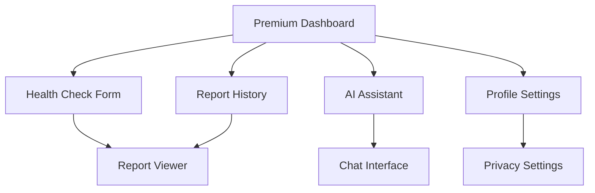

# Premium Design Upgrade Requirements - MediScope AI

## 1. Product Overview

Upgrade MediScope AI's internal application design to a premium, modern medical platform while maintaining the existing main landing page. Transform all dashboard components, internal pages, and user interfaces to reflect a professional, trustworthy, and sophisticated medical application that users would expect from a premium health diagnostics platform.

## 2. Core Features

### 2.1 User Roles

| Role       | Access Level                      | Design Priority                    |
| ---------- | --------------------------------- | ---------------------------------- |
| Free User  | Basic dashboard, limited reports  | Clean, encouraging upgrade prompts |
| Pro User   | Full dashboard, unlimited reports | Premium features highlighted       |
| Admin User | Admin panel, analytics            | Professional data-focused design   |

### 2.2 Feature Module

Our premium design upgrade consists of the following main areas:

1. **Dashboard Layout**: Modern sidebar navigation, glassmorphism effects, improved spacing
2. **Dashboard Components**: Premium cards, advanced data visualization, micro-interactions
3. **Health Check Pages**: Streamlined forms, progress indicators, professional medical aesthetics
4. **Report Viewing**: Enhanced typography, better data presentation, export capabilities
5. **Profile & Settings**: Organized sections, premium form controls, privacy-focused design
6. **AI Assistant Interface**: Chat bubbles, typing indicators, conversation history
7. **Navigation & Layout**: Consistent premium patterns across all pages

### 2.3 Page Details

| Page Name           | Module Name         | Feature description                                                                                                                  |
| ------------------- | ------------------- | ------------------------------------------------------------------------------------------------------------------------------------ |
| Dashboard Layout    | Premium Navigation  | Implement glassmorphism sidebar with smooth animations, breadcrumb navigation, user avatar with dropdown menu, notification center   |
| Dashboard Overview  | Stats Cards         | Create elevated cards with subtle shadows, animated counters, progress rings, health score visualization with color-coded indicators |
| Dashboard Overview  | Quick Actions       | Design prominent CTA buttons with hover effects, recent activity timeline, health insights carousel                                  |
| Health Check Form   | Multi-step Form     | Build progressive form with step indicators, smart field validation, auto-save functionality, medical icons                          |
| Health Check Form   | File Upload         | Create drag-and-drop zone with preview, progress bars, file type validation, medical document recognition                            |
| Report Viewer       | Report Layout       | Design clean typography hierarchy, expandable sections, print-friendly layout, sharing capabilities                                  |
| Report Viewer       | Data Visualization  | Implement charts for health trends, risk level indicators, recommendation cards with action buttons                                  |
| AI Assistant        | Chat Interface      | Build modern chat bubbles, typing indicators, conversation history, quick reply suggestions                                          |
| AI Assistant        | Voice Input         | Add voice recording interface, waveform visualization, speech-to-text feedback                                                       |
| Profile Settings    | User Information    | Create organized form sections, profile photo upload, medical history timeline                                                       |
| Profile Settings    | Privacy Controls    | Design toggle switches, permission levels, data export options, security indicators                                                  |
| Subscription Status | Billing Interface   | Build usage meters, plan comparison cards, upgrade prompts, billing history table                                                    |
| Health History      | Timeline View       | Create chronological health report timeline, filter options, search functionality                                                    |
| Health History      | Report Cards        | Design compact report previews, status indicators, quick actions menu                                                                |
| Admin Panel         | Analytics Dashboard | Implement advanced charts, user metrics, system health indicators, data tables                                                       |
| Admin Panel         | User Management     | Create user list with search, filters, action buttons, detailed user profiles                                                        |

## 3. Core Process

**User Authentication Flow:**
User accesses internal pages → Premium dashboard loads with glassmorphism sidebar → User navigates through enhanced interface → Completes health checks with improved forms → Views reports in premium layout

**Dashboard Navigation Flow:**

## 4. User Interface Design

### 4.1 Design Style

**Color Palette:**

* Primary: #2563EB (Medical Blue)

* Secondary: #059669 (Health Green)

* Accent: #7C3AED (Premium Purple)

* Background: #F8FAFC (Light Gray)

* Surface: #FFFFFF (Pure White)

* Glass: rgba(255, 255, 255, 0.1) (Glassmorphism)

**Typography:**

* Primary Font: Inter (Clean, medical-grade readability)

* Headings: 600-700 weight

* Body: 400-500 weight

* Code/Data: JetBrains Mono

**Component Styles:**

* Cards: Elevated with subtle shadows (0 4px 6px -1px rgba(0, 0, 0, 0.1))

* Buttons: Rounded corners (8px), gradient backgrounds, hover animations

* Forms: Floating labels, focus states, validation feedback

* Navigation: Glassmorphism sidebar with backdrop blur

**Animation Principles:**

* Micro-interactions on hover/click

* Smooth page transitions (300ms ease-in-out)

* Loading states with skeleton screens

* Progressive disclosure for complex data

### 4.2 Page Design Overview

| Page Name          | Module Name        | UI Elements                                                                            |
| ------------------ | ------------------ | -------------------------------------------------------------------------------------- |
| Dashboard Layout   | Sidebar Navigation | Glassmorphism background, smooth hover states, active indicators, collapsible sections |
| Dashboard Layout   | Top Bar            | User avatar dropdown, notification bell, search bar, breadcrumbs                       |
| Dashboard Overview | Hero Section       | Gradient background, welcome message, quick stats, primary CTA                         |
| Dashboard Overview | Stats Grid         | Elevated cards, animated counters, progress indicators, trend arrows                   |
| Health Check Form  | Form Container     | Multi-step progress bar, floating labels, real-time validation, medical icons          |
| Health Check Form  | Upload Zone        | Drag-drop interface, file previews, progress indicators, error states                  |
| Report Viewer      | Header Section     | Report title, date, status badge, action buttons (share, print, download)              |
| Report Viewer      | Content Area       | Typography hierarchy, expandable sections, data tables, charts                         |
| AI Assistant       | Chat Container     | Message bubbles, timestamps, typing indicators, scroll to bottom                       |
| AI Assistant       | Input Area         | Text input with send button, voice recording, file attachment                          |
| Profile Settings   | Form Sections      | Organized tabs, toggle switches, upload areas, save indicators                         |
| Health History     | Timeline           | Chronological layout, filter sidebar, search bar, pagination                           |

### 4.3 Responsiveness

Desktop-first design with mobile-adaptive layouts. Touch-optimized interactions for tablet and mobile devices. Sidebar collapses to hamburger menu on mobile. Cards stack vertically on smaller screens.

### 4.4 Premium Design Patterns

**Glassmorphism Effects:**

* Sidebar navigation with backdrop-filter: blur(10px)

* Modal overlays with semi-transparent backgrounds

* Card hover states with glass-like elevation

**Advanced Animations:**

* Page transitions with slide effects

* Staggered list item animations

* Micro-interactions on buttons and cards

* Loading skeletons for data fetching

**Data Visualization:**

* Health trend charts with smooth animations

* Progress rings for health scores

* Risk level indicators with color coding

* Interactive tooltips and legends

**Professional Medical Aesthetics:**

* Clean, clinical white backgrounds

* Medical blue accent colors

* Professional typography with excellent readability

* Subtle medical iconography

* Trust-building visual elements

### 4.5 Component Library Enhancements

**Enhanced Button Component:**

* Multiple variants (primary, secondary, outline, ghost)

* Size options (sm, md, lg, xl)

* Loading states with spinners

* Icon support with proper spacing

**Premium Card Component:**

* Elevation levels (flat, raised, elevated)

* Hover effects with smooth transitions

* Header, body, and footer sections

* Action button integration

**Advanced Form Components:**

* Floating label inputs

* Multi-select with tags

* Date/time pickers

* File upload with drag-drop

* Form validation with inline feedback

**Data Display Components:**

* Responsive data tables

* Chart components (line, bar, pie, progress)

* Timeline components

* Status indicators and badges

### 4.6 Accessibility & Performance

**Accessibility Features:**

* WCAG 2.1 AA compliance

* Keyboard navigation support

* Screen reader optimization

* High contrast mode support

* Focus indicators for all interactive elements

**Performance Optimizations:**

* Lazy loading for images and components

* Code splitting for route-based chunks

* Optimized animations with CSS transforms

* Efficient re-rendering with React optimization

### 4.7 Implementation Priority

**Phase 1 (Week 1-2): Foundation**

* Enhanced color palette and typography

* Premium Button and Card components

* Dashboard layout with glassmorphism sidebar

* Basic animations and transitions

**Phase 2 (Week 3-4): Core Pages**

* Dashboard overview with stats cards

* Health check form improvements

* Report viewer enhancements

* Navigation improvements

**Phase 3 (Week 5-6): Advanced Features**

* AI assistant interface

* Profile and settings pages

* Data visualization components

* Advanced animations and micro-interactions

**Phase 4 (Week 7-8): Polish & Optimization**

* Accessibility improvements

* Performance optimizations

* Cross-browser testing

* Mobile responsiveness refinement

