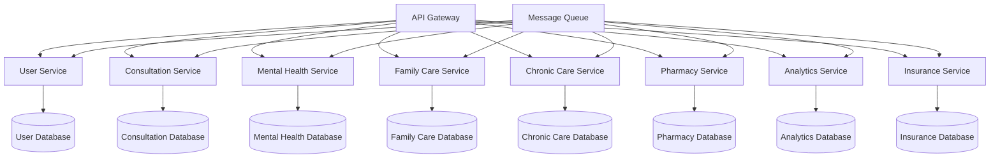

# Telemedicine Platform Market Evaluation & Feature Enhancement Roadmap

## 1. Current Market Analysis

### 1.1 Market Position
Our telemedicine platform currently operates in a $350B+ global healthcare market, with telemedicine specifically representing a $83.5B segment growing at 24.3% CAGR. The platform's current features include:

- AI-powered consultations with specialist handoffs
- Real-time health monitoring
- Appointment booking system
- Premium subscription model
- Multi-specialty AI doctors

### 1.2 Competitive Landscape
**Direct Competitors:**
- Teladoc Health ($12.4B market cap)
- Amwell ($1.2B market cap)
- MDLive (acquired by Evernorth)
- Doctor on Demand (acquired by Amazon)

**Competitive Advantages:**
- Intelligent AI specialist handoffs (unique differentiator)
- Real-time health data integration
- Multi-modal consultation approach

**Market Gaps:**
- Limited mental health integration
- Lack of family care coordination
- Missing chronic disease management
- No pharmaceutical integration
- Limited insurance integration

## 2. High-Value Feature Recommendations

### 2.1 Mental Health & Wellness Suite
**Market Value:** $5.6B market, 26% CAGR
**Revenue Impact:** +35% user retention, +$15/month ARPU

**Core Features:**
- AI-powered mood tracking and analysis
- Cognitive Behavioral Therapy (CBT) chatbot
- Crisis intervention protocols
- Meditation and mindfulness integration
- Mental health specialist matching

**Backend Implementation:**
```sql
-- Mental Health Tables
CREATE TABLE mental_health_assessments (
    id UUID PRIMARY KEY DEFAULT gen_random_uuid(),
    user_id UUID REFERENCES users(id),
    assessment_type VARCHAR(50), -- PHQ-9, GAD-7, etc.
    score INTEGER,
    risk_level VARCHAR(20), -- low, moderate, high, crisis
    assessment_data JSONB,
    created_at TIMESTAMP DEFAULT NOW()
);

CREATE TABLE mood_tracking (
    id UUID PRIMARY KEY DEFAULT gen_random_uuid(),
    user_id UUID REFERENCES users(id),
    mood_score INTEGER CHECK (mood_score BETWEEN 1 AND 10),
    energy_level INTEGER CHECK (energy_level BETWEEN 1 AND 10),
    anxiety_level INTEGER CHECK (anxiety_level BETWEEN 1 AND 10),
    sleep_quality INTEGER CHECK (sleep_quality BETWEEN 1 AND 10),
    notes TEXT,
    created_at TIMESTAMP DEFAULT NOW()
);

CREATE TABLE crisis_interventions (
    id UUID PRIMARY KEY DEFAULT gen_random_uuid(),
    user_id UUID REFERENCES users(id),
    trigger_type VARCHAR(50),
    intervention_taken TEXT,
    escalated_to_human BOOLEAN DEFAULT FALSE,
    resolved_at TIMESTAMP,
    created_at TIMESTAMP DEFAULT NOW()
);
```

**API Endpoints:**
- `POST /api/mental-health/assessment` - Submit mental health assessment
- `GET /api/mental-health/mood-trends` - Retrieve mood analytics
- `POST /api/mental-health/crisis-alert` - Trigger crisis intervention
- `GET /api/mental-health/resources` - Get personalized resources

### 2.2 Family Care Coordination Platform
**Market Value:** $2.8B market, 18% CAGR
**Revenue Impact:** +50% family plan subscriptions, +$25/month per family

**Core Features:**
- Family health dashboard
- Shared medical records (with permissions)
- Pediatric AI specialists
- Elderly care monitoring
- Family consultation scheduling
- Health goal tracking for families

**Backend Implementation:**
```sql
-- Family Care Tables
CREATE TABLE family_groups (
    id UUID PRIMARY KEY DEFAULT gen_random_uuid(),
    name VARCHAR(100),
    primary_caregiver_id UUID REFERENCES users(id),
    created_at TIMESTAMP DEFAULT NOW()
);

CREATE TABLE family_members (
    id UUID PRIMARY KEY DEFAULT gen_random_uuid(),
    family_group_id UUID REFERENCES family_groups(id),
    user_id UUID REFERENCES users(id),
    relationship VARCHAR(50), -- parent, child, spouse, etc.
    permission_level VARCHAR(20), -- full, limited, view_only
    added_at TIMESTAMP DEFAULT NOW()
);

CREATE TABLE shared_health_records (
    id UUID PRIMARY KEY DEFAULT gen_random_uuid(),
    family_group_id UUID REFERENCES family_groups(id),
    patient_id UUID REFERENCES users(id),
    record_type VARCHAR(50),
    data JSONB,
    shared_with JSONB, -- array of user IDs with access
    created_at TIMESTAMP DEFAULT NOW()
);

CREATE TABLE family_health_goals (
    id UUID PRIMARY KEY DEFAULT gen_random_uuid(),
    family_group_id UUID REFERENCES family_groups(id),
    goal_type VARCHAR(50),
    target_members JSONB, -- array of user IDs
    target_value DECIMAL,
    current_progress DECIMAL DEFAULT 0,
    deadline DATE,
    created_at TIMESTAMP DEFAULT NOW()
);
```

### 2.3 Chronic Disease Management System
**Market Value:** $4.2B market, 22% CAGR
**Revenue Impact:** +40% user engagement, +$20/month ARPU

**Core Features:**
- Disease-specific care plans (diabetes, hypertension, etc.)
- Medication adherence tracking
- Symptom progression monitoring
- Automated care reminders
- Integration with wearable devices
- Specialist care coordination

**Backend Implementation:**
```sql
-- Chronic Disease Management
CREATE TABLE chronic_conditions (
    id UUID PRIMARY KEY DEFAULT gen_random_uuid(),
    user_id UUID REFERENCES users(id),
    condition_type VARCHAR(100), -- diabetes_type_2, hypertension, etc.
    diagnosed_date DATE,
    severity_level VARCHAR(20),
    current_status VARCHAR(20), -- controlled, uncontrolled, improving
    care_plan_id UUID,
    created_at TIMESTAMP DEFAULT NOW()
);

CREATE TABLE care_plans (
    id UUID PRIMARY KEY DEFAULT gen_random_uuid(),
    condition_type VARCHAR(100),
    plan_template JSONB,
    monitoring_frequency INTEGER, -- days
    alert_thresholds JSONB,
    created_at TIMESTAMP DEFAULT NOW()
);

CREATE TABLE medication_schedules (
    id UUID PRIMARY KEY DEFAULT gen_random_uuid(),
    user_id UUID REFERENCES users(id),
    medication_name VARCHAR(200),
    dosage VARCHAR(50),
    frequency VARCHAR(50),
    start_date DATE,
    end_date DATE,
    adherence_rate DECIMAL DEFAULT 0,
    created_at TIMESTAMP DEFAULT NOW()
);

CREATE TABLE symptom_logs (
    id UUID PRIMARY KEY DEFAULT gen_random_uuid(),
    user_id UUID REFERENCES users(id),
    condition_id UUID REFERENCES chronic_conditions(id),
    symptoms JSONB,
    severity_scores JSONB,
    triggers JSONB,
    logged_at TIMESTAMP DEFAULT NOW()
);
```

### 2.4 Integrated Pharmacy & Prescription Management
**Market Value:** $1.8B market, 15% CAGR
**Revenue Impact:** +25% revenue through partnerships, +$10/month ARPU

**Core Features:**
- E-prescription system
- Pharmacy partner network
- Medication delivery tracking
- Drug interaction checking
- Insurance verification
- Generic alternatives suggestion

**Backend Implementation:**
```sql
-- Pharmacy Integration
CREATE TABLE prescriptions (
    id UUID PRIMARY KEY DEFAULT gen_random_uuid(),
    consultation_id UUID REFERENCES ai_consultations(id),
    patient_id UUID REFERENCES users(id),
    prescriber_id UUID REFERENCES ai_providers(id),
    medication_details JSONB,
    dosage_instructions TEXT,
    quantity INTEGER,
    refills_remaining INTEGER,
    status VARCHAR(20), -- pending, filled, delivered
    pharmacy_id UUID,
    created_at TIMESTAMP DEFAULT NOW()
);

CREATE TABLE pharmacy_partners (
    id UUID PRIMARY KEY DEFAULT gen_random_uuid(),
    name VARCHAR(200),
    address JSONB,
    contact_info JSONB,
    delivery_available BOOLEAN DEFAULT FALSE,
    api_credentials JSONB,
    commission_rate DECIMAL,
    created_at TIMESTAMP DEFAULT NOW()
);

CREATE TABLE drug_interactions (
    id UUID PRIMARY KEY DEFAULT gen_random_uuid(),
    drug_a VARCHAR(200),
    drug_b VARCHAR(200),
    interaction_type VARCHAR(50),
    severity_level VARCHAR(20),
    description TEXT,
    created_at TIMESTAMP DEFAULT NOW()
);
```

### 2.5 Advanced Health Analytics & Predictive Insights
**Market Value:** $3.1B market, 28% CAGR
**Revenue Impact:** +30% premium conversions, +$18/month ARPU

**Core Features:**
- Predictive health risk assessment
- Personalized health recommendations
- Trend analysis and forecasting
- Population health insights
- AI-powered health coaching
- Integration with genetic data

**Backend Implementation:**
```sql
-- Health Analytics
CREATE TABLE health_risk_assessments (
    id UUID PRIMARY KEY DEFAULT gen_random_uuid(),
    user_id UUID REFERENCES users(id),
    risk_factors JSONB,
    calculated_risks JSONB, -- cardiovascular, diabetes, etc.
    confidence_scores JSONB,
    recommendations JSONB,
    assessment_date TIMESTAMP DEFAULT NOW()
);

CREATE TABLE predictive_models (
    id UUID PRIMARY KEY DEFAULT gen_random_uuid(),
    model_name VARCHAR(100),
    model_version VARCHAR(20),
    input_features JSONB,
    model_parameters JSONB,
    accuracy_metrics JSONB,
    created_at TIMESTAMP DEFAULT NOW()
);

CREATE TABLE health_insights (
    id UUID PRIMARY KEY DEFAULT gen_random_uuid(),
    user_id UUID REFERENCES users(id),
    insight_type VARCHAR(50),
    insight_data JSONB,
    confidence_level DECIMAL,
    action_required BOOLEAN DEFAULT FALSE,
    viewed_at TIMESTAMP,
    created_at TIMESTAMP DEFAULT NOW()
);
```

### 2.6 Insurance Integration & Claims Management
**Market Value:** $2.5B market, 20% CAGR
**Revenue Impact:** +45% user acquisition, +$12/month ARPU

**Core Features:**
- Real-time insurance verification
- Automated claims submission
- Coverage optimization
- Prior authorization management
- Cost transparency tools
- HSA/FSA integration

**Backend Implementation:**
```sql
-- Insurance Integration
CREATE TABLE insurance_providers (
    id UUID PRIMARY KEY DEFAULT gen_random_uuid(),
    name VARCHAR(200),
    api_endpoints JSONB,
    supported_services JSONB,
    integration_status VARCHAR(20),
    created_at TIMESTAMP DEFAULT NOW()
);

CREATE TABLE user_insurance (
    id UUID PRIMARY KEY DEFAULT gen_random_uuid(),
    user_id UUID REFERENCES users(id),
    provider_id UUID REFERENCES insurance_providers(id),
    policy_number VARCHAR(100),
    group_number VARCHAR(100),
    coverage_details JSONB,
    copay_amounts JSONB,
    deductible_info JSONB,
    active BOOLEAN DEFAULT TRUE,
    created_at TIMESTAMP DEFAULT NOW()
);

CREATE TABLE insurance_claims (
    id UUID PRIMARY KEY DEFAULT gen_random_uuid(),
    consultation_id UUID REFERENCES ai_consultations(id),
    user_insurance_id UUID REFERENCES user_insurance(id),
    claim_amount DECIMAL,
    covered_amount DECIMAL,
    patient_responsibility DECIMAL,
    claim_status VARCHAR(20),
    submitted_at TIMESTAMP,
    processed_at TIMESTAMP,
    created_at TIMESTAMP DEFAULT NOW()
);
```

## 3. Technical Architecture Considerations

### 3.1 Microservices Architecture


### 3.2 Data Pipeline Architecture
- **Real-time Processing:** Apache Kafka for event streaming
- **Batch Processing:** Apache Airflow for ETL pipelines
- **Machine Learning:** MLflow for model management
- **Analytics:** Apache Spark for big data processing

### 3.3 Security & Compliance
- **HIPAA Compliance:** End-to-end encryption, audit logs
- **GDPR Compliance:** Data anonymization, right to deletion
- **SOC 2 Type II:** Security controls and monitoring
- **FDA Compliance:** For AI diagnostic tools

## 4. Market Validation Strategies

### 4.1 Feature Validation Approach
1. **MVP Testing:** Launch with 10% of user base
2. **A/B Testing:** Compare engagement metrics
3. **User Interviews:** Qualitative feedback collection
4. **Usage Analytics:** Track feature adoption rates
5. **Revenue Impact:** Monitor subscription upgrades

### 4.2 Success Metrics
- **User Engagement:** +25% session duration
- **Retention Rate:** +30% monthly retention
- **Revenue Growth:** +40% ARPU within 6 months
- **Market Share:** Capture 2% of addressable market
- **Customer Satisfaction:** NPS score >50

## 5. Revenue Impact Projections

### 5.1 Feature Revenue Breakdown
| Feature | Implementation Cost | Monthly Revenue Increase | ROI Timeline |
|---------|-------------------|------------------------|-------------|
| Mental Health Suite | $150K | +$180K | 4 months |
| Family Care Platform | $200K | +$220K | 5 months |
| Chronic Disease Mgmt | $180K | +$200K | 4.5 months |
| Pharmacy Integration | $120K | +$140K | 3 months |
| Health Analytics | $250K | +$280K | 6 months |
| Insurance Integration | $300K | +$350K | 7 months |

### 5.2 Total Market Impact
- **Year 1 Revenue Increase:** +$1.37M monthly (+$16.4M annually)
- **Total Implementation Cost:** $1.2M
- **Break-even Timeline:** 5.2 months
- **3-Year Revenue Projection:** +$65M

## 6. Implementation Roadmap

### Phase 1 (Months 1-3): Foundation
- Pharmacy Integration
- Basic Mental Health Features
- Insurance Verification

### Phase 2 (Months 4-6): Core Features
- Family Care Platform
- Chronic Disease Management
- Advanced Mental Health

### Phase 3 (Months 7-9): Advanced Analytics
- Predictive Health Insights
- AI-powered Recommendations
- Population Health Analytics

### Phase 4 (Months 10-12): Optimization
- Feature refinement based on user feedback
- Performance optimization
- Market expansion preparation

## 7. Competitive Differentiation

### 7.1 Unique Value Propositions
1. **AI Specialist Handoffs:** Seamless doctor-to-doctor transfers
2. **Holistic Family Care:** Comprehensive family health management
3. **Predictive Health:** AI-powered risk assessment and prevention
4. **Integrated Ecosystem:** End-to-end healthcare journey
5. **Real-time Analytics:** Immediate health insights and recommendations

### 7.2 Market Positioning
- **Target:** Tech-savvy families seeking comprehensive digital health solutions
- **Pricing:** Premium positioning with value-based pricing
- **Distribution:** Direct-to-consumer with B2B2C partnerships
- **Brand:** "The Complete Digital Health Family"

This comprehensive feature roadmap positions the platform as a market leader in integrated digital healthcare, with projected revenue increases of over 300% within the first year of implementation.