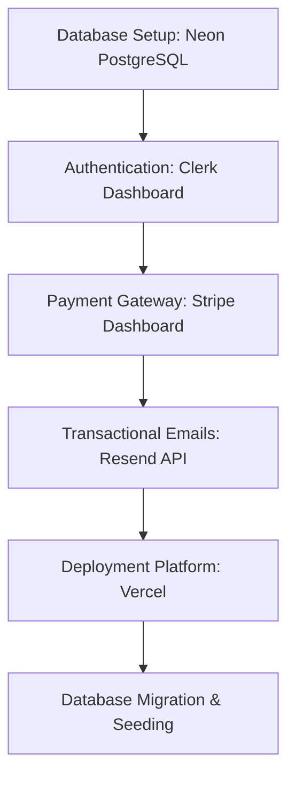

# DiagnoGenie Production Deployment Guide

This guide describes how to deploy DiagnoGenie into a production environment. 

---

## Deployment Checklist & Steps



---

## 1. Database Setup (Neon PostgreSQL)

DiagnoGenie uses **Neon** serverless Postgres database with **Drizzle ORM**.

1. **Create Database**:
   - Go to [Neon Console](https://console.neon.tech/) and create a new project.
   - Select your preferred region (choose a region close to your Vercel deployment region, e.g., `us-east-1`).
   - Copy the connection string. Make sure to use the pooled database connection string (`-pooler`).
2. **Apply Migrations**:
   - Save your connection string to `DATABASE_URL` in `.env.local` locally, then run the migrations to create the database schema:
     ```bash
     npm run db:migrate
     ```
3. **Seed Database**:
   - Populate default medical conditions, symptoms, and subscription plans in the database:
     ```bash
     npm run db:seed
     ```

---

## 2. Authentication Setup (Clerk)

DiagnoGenie uses **Clerk** for user authentication.

1. **Create Production Instance**:
   - Go to your [Clerk Dashboard](https://dashboard.clerk.com/) and create a new application instance.
   - Copy the **Publishable Key** and **Secret Key**.
2. **Set up Webhook (Crucial for DB Syncing)**:
   - Go to **Webhooks** in the Clerk Dashboard and add an endpoint.
   - Endpoint URL: `https://your-production-domain.com/api/webhooks/clerk`
   - Select the following event: `user.created`
   - Copy the Webhook **Signing Secret** to set as your `CLERK_WEBHOOK_SECRET` environment variable.

---

## 3. Stripe Setup

DiagnoGenie handles memberships and subscriptions using **Stripe**.

1. **Stripe Account**:
   - Log in to your [Stripe Dashboard](https://dashboard.stripe.com/).
   - Copy your **Secret Key** (`sk_live_...`).
2. **Configure Products & Prices**:
   - Create two subscription products in Stripe:
     - **Pro Plan** (e.g., $19/month)
     - **Family Plan** (e.g., $39/month)
   - Copy their respective **Price IDs** (`price_...`).
   - Set these as:
     - `STRIPE_PRO_PRICE_ID` and `NEXT_PUBLIC_STRIPE_PRO_PRICE_ID`
     - `STRIPE_FAMILY_PRICE_ID` and `NEXT_PUBLIC_STRIPE_FAMILY_PRICE_ID`
3. **Configure Webhook**:
   - Go to Stripe Developer Dashboard > **Webhooks** and add an endpoint.
   - Endpoint URL: `https://your-production-domain.com/api/stripe/webhook`
   - Select the following events:
     - `checkout.session.completed`
     - `customer.subscription.created`
     - `customer.subscription.updated`
     - `customer.subscription.deleted`
     - `invoice.payment_succeeded`
     - `invoice.payment_failed`
   - Copy the webhook **Signing Secret** (`whsec_...`) and save as `STRIPE_WEBHOOK_SECRET`.

---

## 4. Email Service (Resend)

DiagnoGenie uses **Resend** to send automated notifications and receipt emails.

1. Create a [Resend Account](https://resend.com/).
2. Add and verify your domain in the Resend dashboard.
3. Generate an API Key and set it as `RESEND_API_KEY`.

---

## 5. Deployment on Vercel

Vercel is the recommended hosting platform for Next.js.

1. **Connect Repository**:
   - Go to [Vercel](https://vercel.com/) and create a new project.
   - Import your GitHub/Gitlab repository.
2. **Configure Build Commands**:
   - Framework preset: **Next.js**
   - Build command: `next build`
   - Install command: `npm install`
3. **Set Environment Variables**:
   Add all environment variables from `.env.example` in the Vercel Project settings under **Environment Variables**.
4. **Deploy**:
   - Click **Deploy**. Vercel will build and launch your production site.
